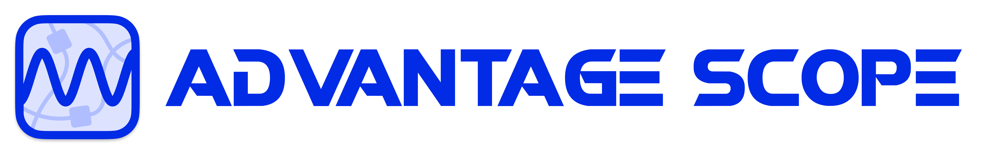

import DocCardList from "@theme/DocCardList";
import ScreenshotLight from "./img/screenshot-light.png";
import ScreenshotDark from "./img/screenshot-dark.png";

#

AdvantageScope is a robot diagnostics, log review/analysis, and data visualization application for FIRST teams developed by [Team 6328](https://littletonrobotics.org). It reads logs in WPILOG, DS log, Hoot (CTRE), REVLOG (REV Robotics), Road Runner, CSV, and RLOG file formats, plus live robot data viewing using NT4, Phoenix, RLOG, or FTC Dashboard streaming. AdvantageScope can be used with any WPILib project, but is also optimized for use with our [AdvantageKit](https://docs.advantagekit.org) log replay framework. Note that **AdvantageKit is not required to use AdvantageScope**.

<DocCardList
items={[
{
type: "category",
label: "Overview",
href: "/category/overview"
},
{
type: "category",
label: "Tab Reference",
href: "/category/tab-reference"
},
{
type: "category",
label: "More Features",
href: "/category/more-features"
},
{
type: "category",
label: "Championship Conference",
href: "/overview/champs-conference"
}
]}
/>

AdvantageScope includes the following tools:

- A wide selection of flexible graphs and charts
- 2D and 3D field visualizations of pose data, with customizable CAD-based robots
- Synchronized video playback from a separately loaded match video
- Joystick visualization, showing driver actions on customizable controller representations
- Swerve drive module vector displays
- Console message review
- Log statistics analysis
- Flexible export options, with support for CSV and WPILOG

<Button
label="Go to Downloads"
link="https://github.com/Mechanical-Advantage/AdvantageScope/releases/latest"
variant="primary"
size="lg"
block
style={{ marginBottom: "15px" }}
/>

Feedback, feature requests, and bug reports are welcome on the [issues page](https://github.com/Mechanical-Advantage/AdvantageScope/issues). See the [contribution page](https://github.com/Mechanical-Advantage/AdvantageScope/blob/main/CONTRIBUTING.md) for more information on contributing to AdvantageScope. For non-public inquiries, please send a message to software@team6328.org.

