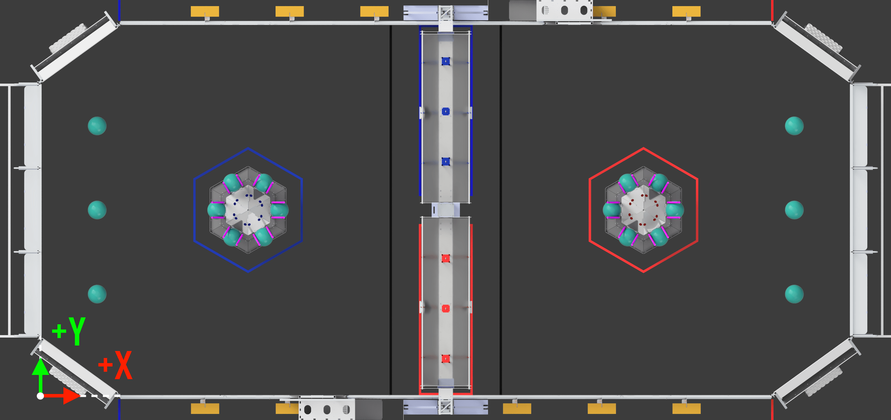
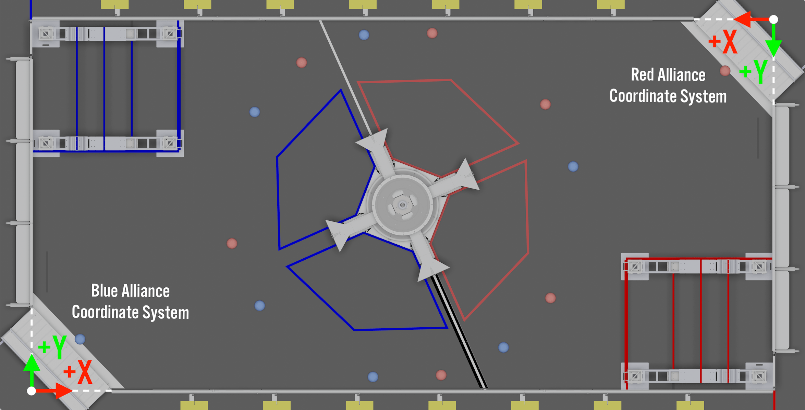
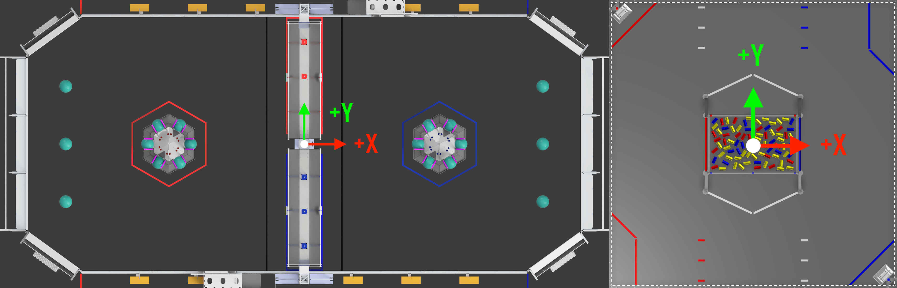

import PrefsImage from '../img/prefs.png';
import CenterRotatedDiagram from './img/coordinate-system-center-rotated.png';

# 📐 Coordinate Systems

AdvantageScope includes support for several common coordinate systems on the [🗺️ 2D Field](/tab-reference/2d-field) and [👀 3D Field](/tab-reference/3d-field) tabs. Please reference the [WPILib coordinate system documentation](https://docs.wpilib.org/en/stable/docs/software/basic-programming/coordinate-system.html#wpilib-coordinate-system) for more information on the axis and rotation conventions used by AdvantageScope.

### Customization

By default, the coordinate system is automatically selected based on the chosen field image/model. To select a different coordinate system for use on all fields, open the preferences window by clicking `App` > `Show Preferences...` (Windows/Linux) or `AdvantageScope` > `Settings...` (macOS) and change the "Coordinate System" option.

:::tip
All coordinate system options are compatible with both FRC and FTC fields.
:::

## Blue Wall

The origin is in the rightmost corner of the blue alliance wall with the +X axis facing the red alliance wall, as shown below. **This is the default coordinate system for FRC fields from 2023 to 2026.**

## Alliance Wall

The origin is in the rightmost corner of the alliance wall for the _robot's current alliance_ with the +X axis facing the opposite alliance wall, as shown below. **This is the default coordinate system for FRC in 2022.**

## Center/Rotated

The origin is in the center of the field with the +X axis facing to the right from the perspective of the red alliance wall, as shown below. **This is the default coordinate system for FTC fields from 2024-2025 to 2026-2027.**

## Center/Red (Systemcore)

The origin is in the center of the field with the +X axis facing away from the red alliance wall, as shown below. **This is the default coordinate system for FRC fields starting in 2027 and FTC fields starting in 2027-2028.**

:::warning
This coordinate system is only available in the 2027 (v27.x) releases of AdvantageScope.
:::

