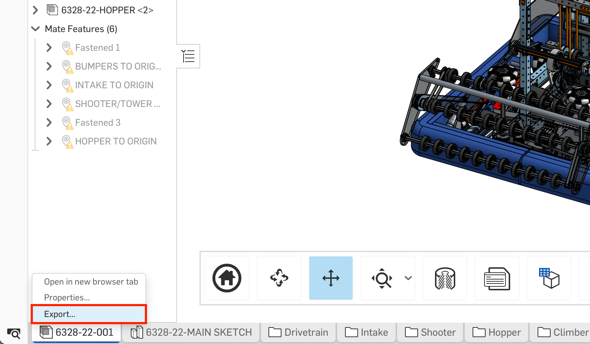
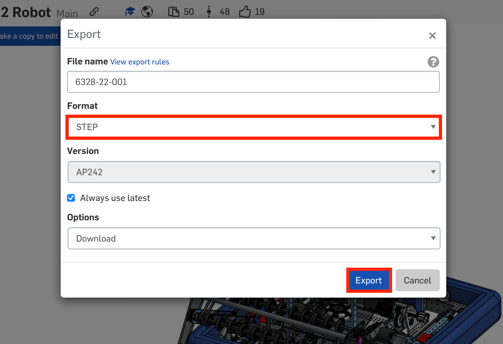
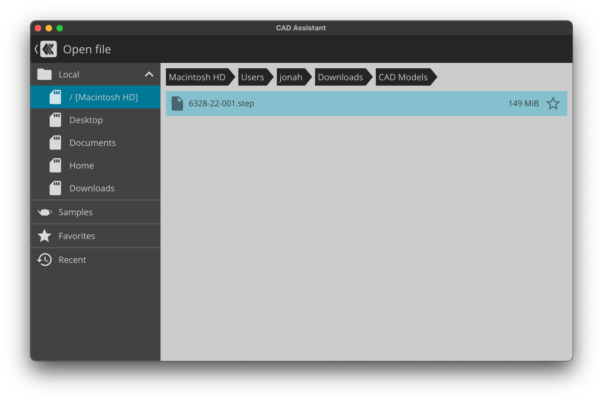
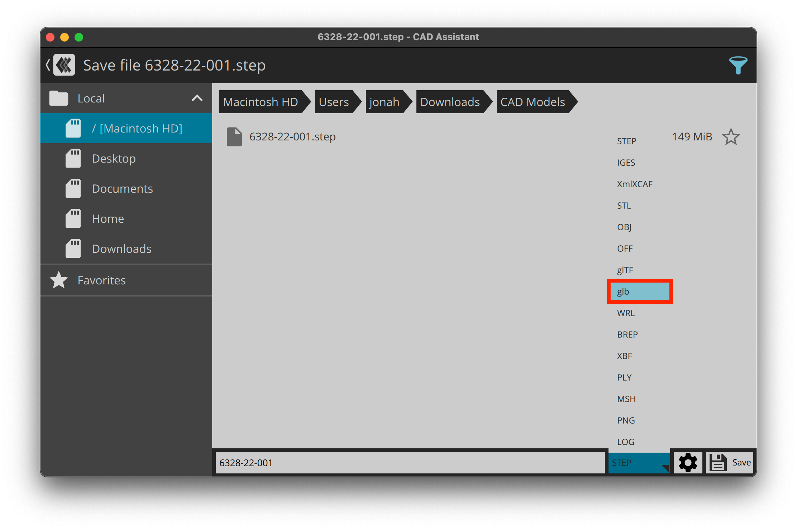
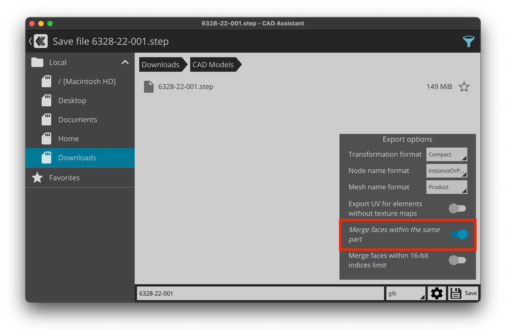
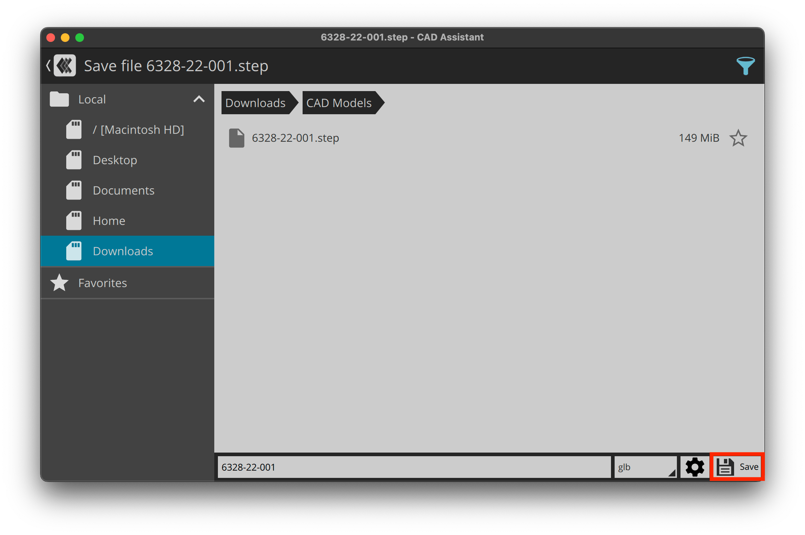

# Converting Onshape & STEP Files to glTF

AdvantageScope's 3D view accepts custom models for fields and robots, which can be installed using the process described [here](../more-features/custom-assets.md). All models must use the [glTF](https://www.khronos.org/gltf/) file format, chosen for its efficiency when storing and loading models. Note that AdvantageScope uses the binary form (.glb), which includes all resources in a single file, rather than the pure JSON form (.gltf).

## Converting Onshape to STEP

While Onshape includes an export option for glTF, this often produces very large files that are difficult to manage. Instead, it is recommended to export from Onshape to STEP, then follow the instructions in the next section to convert to glTF.

1. After opening the Onshape file, right-click on the main assembly and choose "Export...":

2. In the options pop-up, ensure that the export format is "STEP" and click "Export":

3. Wait for the file to convert and download. This may take a few minutes.

## Converting STEP to glTF

1. Download [CAD Assistant](https://www.opencascade.com/products/cad-assistant/). This free application is able to convert between many 3D formats, including STEP and glTF.

2. Open CAD Assistant and select the STEP file to convert:

3. Wait for the STEP file to import. This may take a few minutes.

4. Click the "Save" icon:

5. Choose a save location, then use the drop-down to switch the export format to "glb":

6. Click the gear icon, then enable "Merge faces within the same part":

7. Click the "Save" icon and wait for the export to finish:

