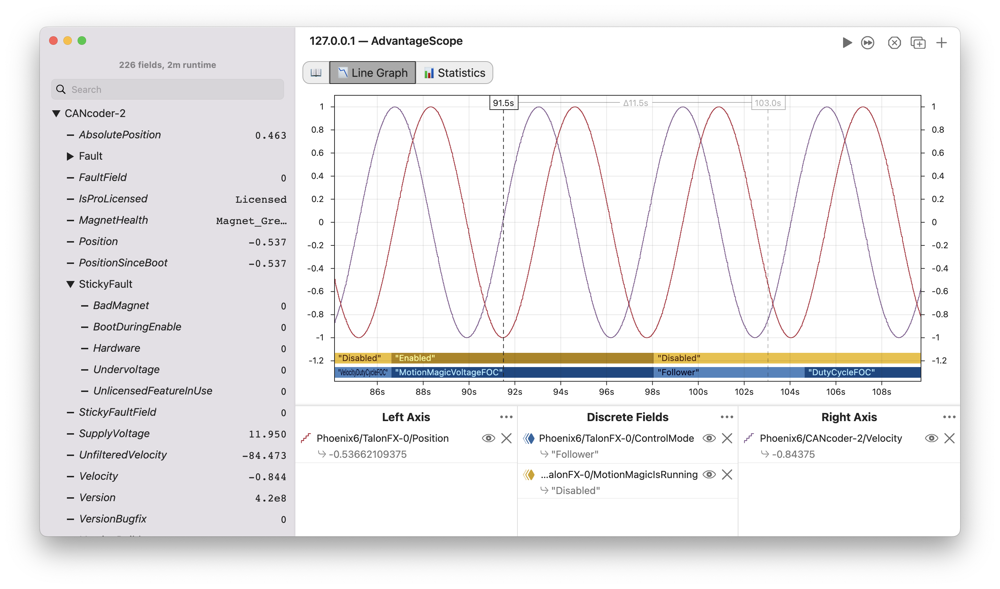
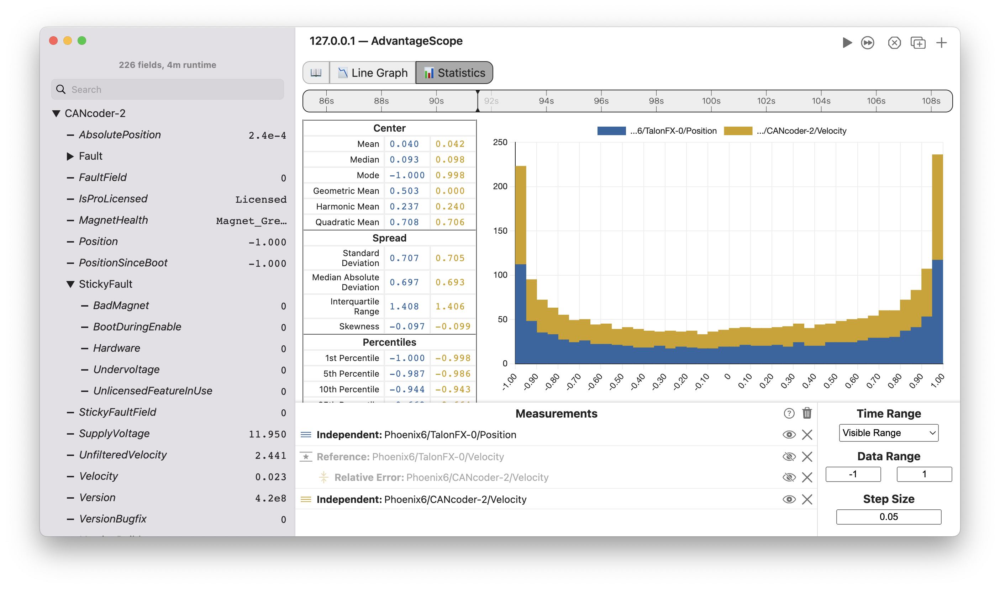

# Phoenix Diagnostics

AdvantageScope supports live-streaming of signals from Phoenix 6 devices with **no setup in user code**. This enables easy debugging and tuning of Phoenix devices using the familiar interface and full power of AdvantageScope:

- Flexible visualization options, including support for multiple axes and discrete fields
- Live preview of all values in the sidebar for easy browsing
- Support for plotting and signal preview from multiple devices simultaneously
- Decoding of enum values as human-readable strings (control modes, bridge status, CANcoder magnet state, etc)
- Integrated sidebar tooltips with descriptions and units for each signal
- Hierarchical organization of signals, grouped by CAN bus, device, and signal type

:::tip
To connect, select "Phoenix Diagnostics" from the list of [live sources](/getting-started/connect-live#live-source) in the preferences menu. Then, click "Connect to Robot" or "Connect to Simulator" from the menu bar as normal.
:::

AdvantageScope's 📊 [Statistics](/tab-reference/statistics) tab also enables advanced analysis of Phoenix signals, with support for histograms, custom ranges, and derived fields for relative and absolute error measurements:

:::note
This feature may occasionally experience issues as a result of Phoenix updates. We recommend using the latest version of AdvantageScope to minimize issues. Otherwise, please [open an issue](https://github.com/Mechanical-Advantage/AdvantageScope/issues) to let us know about any problems.
:::
