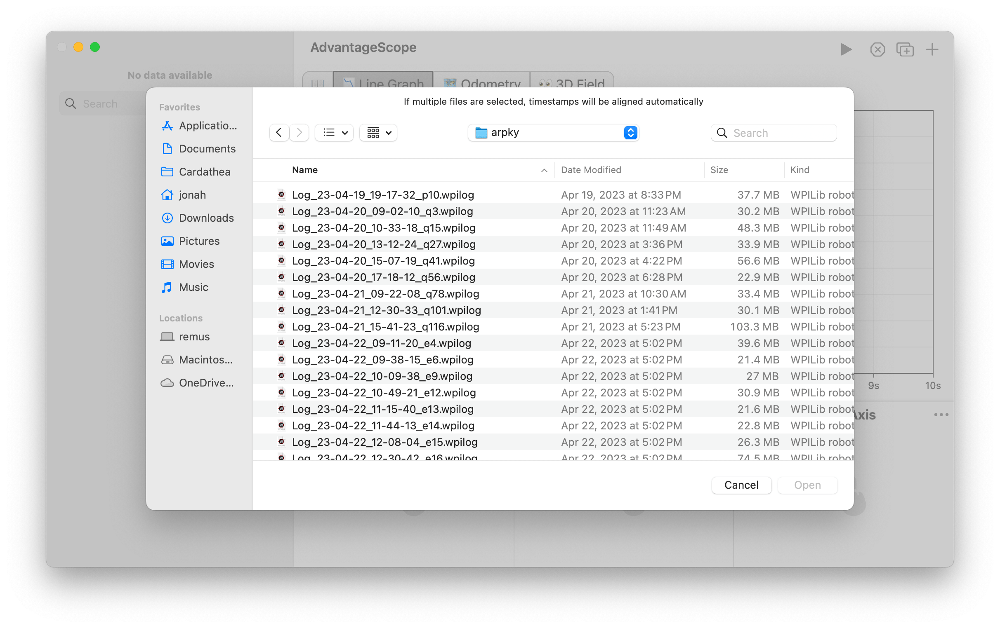

import PrefsImage from '../../img/prefs.png';
import Image2 from './img/open-file-2.png';

# 📂 Log Files

## Supported Formats

- **WPILOG (.wpilog)** - Produced by WPILib's [built-in data logging](https://docs.wpilib.org/en/stable/docs/software/telemetry/datalog.html) and AdvantageKit. [URCL](/more-features/urcl) can be used to capture signals from REV motor controllers to a WPILOG file.
- **Driver Station logs (.dslog and .dsevents)** - Produced by the [FRC Driver Station](https://docs.wpilib.org/en/stable/docs/software/driverstation/driver-station.html). AdvantageScope automatically searches for the corresponding log file when opening either log type.
- **Hoot (.hoot)** - Produced by CTRE's Phoenix 6 [signal logger](https://pro.docs.ctr-electronics.com/en/latest/docs/api-reference/api-usage/signal-logging.html).
- **REVLOG (.revlog)** - Produced by REV Robotics' [`StatusLogger`](https://codedocs.revrobotics.com/java/com/revrobotics/util/statuslogger).
- **Road Runner (.log)** - Produced by the [Road Runner](https://github.com/acmerobotics/road-runner) library for FTC.
- **CSV (.csv)** - Comma separated values, matching the format [exported](/overview/log-files/export) by AdvantageScope in the "CSV (Table)" or "CSV (List)" modes. See [here](#csv-formatting) for details.
- **RLOG (.rlog)** - Legacy, produced by AdvantageKit 2022.

:::info
Hoot log files can only be opened after agreeing to CTRE's [end user license agreement](https://raw.githubusercontent.com/CrossTheRoadElec/Phoenix-Releases/refs/heads/master/CTRE_LICENSE.txt). AdvantageScope displays a prompt to confirm agreement to these terms when opening a Hoot log file for the first time.
:::

## Opening Logs

In the menu bar, click `File` > `Open Log(s)...`, then choose a one or more log files from the local disk. Dragging a log file from the system file browser to the AdvantageScope icon or window also causes it to open.

:::info
If multiple files are opened simultaneously, the timestamps will be aligned automatically. This enables easy comparison of log files from multiple sources.
:::

## Adding New Logs

After opening a log file, additional logs can be easily added to the visualization. Timestamps will be realigned automatically to synchronize with existing data.

In the menu bar, click `File` > `Add News Log(s)...`, then choose a one or more log files to add to the current visualization. The fields from each log will be recorded under tables named `Log0`, `Log1`, etc.

## Downloading From the Robot

Configuration

Open the preferences window by clicking `App` > `Show Preferences...` (Windows/Linux) or `AdvantageScope` > `Settings...` (macOS). Update the robot address and log folder. Click `File` > `Use USB roboRIO Address` to temporarily use the IP address `172.22.11.2` for all connections.

Click `File` > `Download Logs...` to open the download window. Once connected to the robot, available logs are shown with the newest at the top. Select one or more log files to download (shift-click to select a range or **cmd/ctrl + A** to select all). Then click the ↓ symbol and select a save location.

:::info
CTRE's [Signal Logger](https://v6.docs.ctr-electronics.com/en/stable/docs/api-reference/api-usage/signal-logging.html) uses a nonstandard format that groups logs in subfolders. Select one or more folders in the list to download the log files as a group.
:::

:::tip
When downloading multiple files, AdvantageScope skips any that already exist in the destination folder.
:::

## CSV Formatting

CSV column names must be either "Timestamp, Key, Value" or "Timestamp, (Key), (Key), etc". Timestamp values are in seconds. The list below shows the expected format of common value types. Note that exporting and reimporting log data as a CSV is _lossy_, since CSV does not support complex field types.

- **Booleans:** `true` or `false`
- **Strings:** `"(value)"`
  - Example: `"Hello world"`
- **Arrays:** `[(value); (value); (value)]`
  - Example: `[1; 2; 3]`
- **Bytes:** hexadecimal, separated by `-`
  - Example: `4d-41-36-33-32-38`
