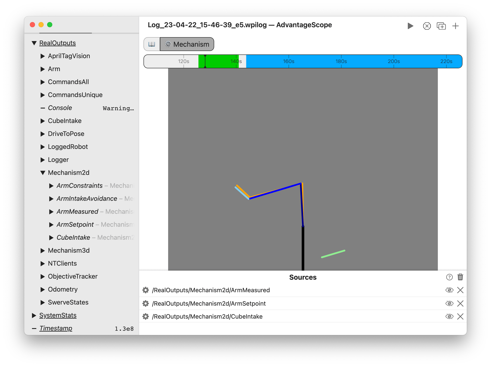

import Tabs from '@theme/Tabs';
import TabItem from '@theme/TabItem';

# ⚙️ Mechanism

The mechanism tab displays a a jointed mechanism created with one or more [Mechanism2d](https://docs.wpilib.org/en/stable/docs/software/dashboards/glass/mech2d-widget.html) objects.



<details>
<summary>Timeline Controls</summary>

The timeline is used to control playback and visualization. Clicking on the timeline selects a time, and right-clicking deselects it. The selected time is synchronized across all tabs, making it easy to quickly find this location in other views.

The green sections of the timeline indicate when the robot is autonomous, and the blue sections indicate when the robot is teleoperated.

To zoom, place the cursor over the timeline and scroll up or down. A range can also be selecting by clicking and dragging while holding `Shift`. Move left and right by scrolling horizontally (on supported devices), or by clicking and dragging on the timeline. When connected live, scrolling to the left unlocks from the current time, and scrolling all the way to the right locks to the current time again. Press `Ctrl+\` to zoom to the period where the robot is enabled.


</details>

## Adding Mechanisms

To get started, drag a `Mechanism2d` to the control pane. Delete a mechanism using the X button, or hide it temporarily by clicking the eye icon or double-clicking the field name. To remove all mechanisms, click the trash can near the axis title and then `Clear All`. Mechanisms can be rearranged in the list by clicking and dragging.

## Publishing Data

<Tabs groupId="library">
<TabItem value="wpilib" label="WPILib" default>

To publish mechanism data using WPILib, send a `Mechanism2d` object to NetworkTables (shown below). If data logging is enabled, the mechanisms can also be viewed based the generated WPILOG file.

```java
Mechanism2d mechanism = new Mechanism2d(3, 3);
SmartDashboard.putData("MyMechanism", mechanism);
```

</TabItem>
<TabItem value="advantagekit" label="AdvantageKit">

To publish mechanism data using AdvantageKit, record a `Mechanism2d` as an output field (shown below). Note that this call only records the current state of the `Mechanism2d`, so it must be called every loop cycle after the object is updated.

```java
LoggedMechanism2d mechanism = new LoggedMechanism2d(3, 3);
Logger.recordOutput("MyMechanism", mechanism);
```

</TabItem>
</Tabs>
