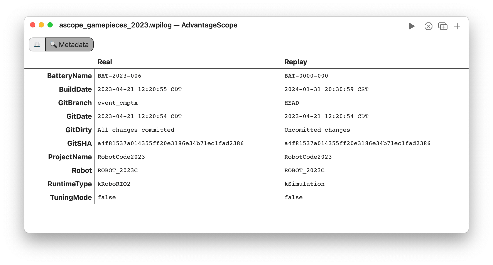

import Tabs from '@theme/Tabs';
import TabItem from '@theme/TabItem';

# 🔍 Metadata

The metadata tab shows values published to the hidden "/Metadata" table or through AdvantageKit. The metadata keys are displayed to the left, and the columns separate data from different sources (e.g. real and replay when using AdvantageKit).



The example code below shows how to log metadata using Java.

<Tabs groupId="library">
<TabItem value="wpilib" label="WPILib" default>

In WPILib, log values to the "/Metadata" table as strings using the `Telemetry` class.

```java
TelemetryTable metadata = Telemetry.getTable("Metadata");
metadata.log("RobotName", "Darwin");
metadata.log("Platform", "macOS");
```

</TabItem>
<TabItem value="advantagekit" label="AdvantageKit">

In AdvantageKit, call the method below before starting the logger. Metadata is stored separately when running in real and replay for easy comparison.

```java
Logger.recordMetadata("RobotName", "Darwin");
Logger.recordMetadata("Platform", "macOS");
```

</TabItem>
</Tabs>
