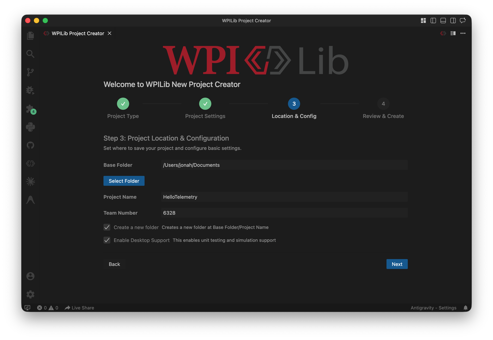
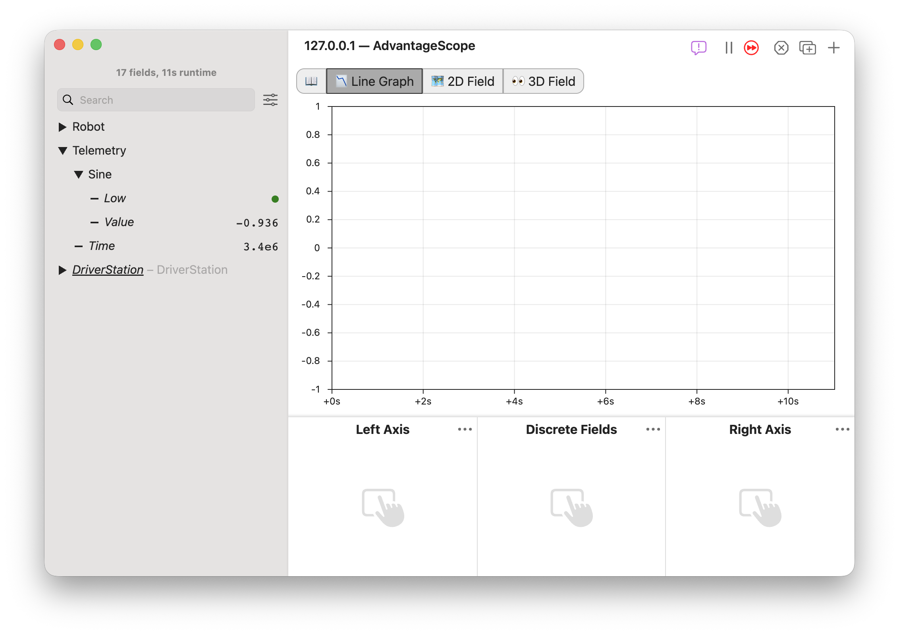
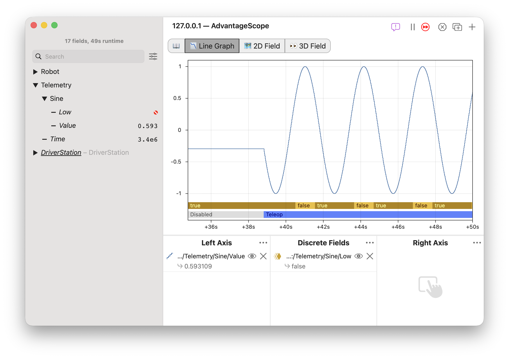
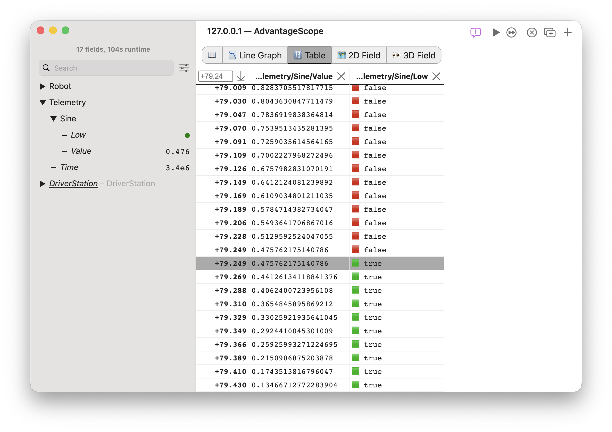
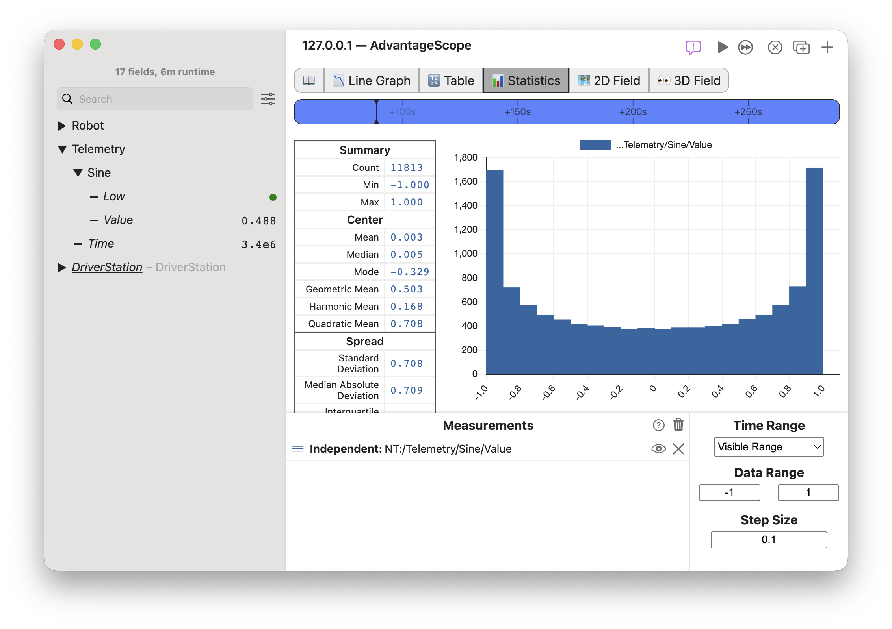

import Image2 from "./img/hello-telemetry-2.png";
import DownloadImage from "../overview/log-files/img/open-file-2.png";

# 👋 Hello, Telemetry!

Welcome to AdvantageScope! Telemetry and data logging are powerful capabilities that can improve your ability to understand robot code, diagnose problems, and implement solutions on and off the field. These tutorials are designed to get you started with telemetry so that you can take advantage of the full capabilities of AdvantageScope.

In this tutorial, you will learn how to:

- Set up basic robot telemetry in a Java WPILib project.
- Connect to live data streams in AdvantageScope.
- Record data to log files for later access.
- Visualize telemetry data using AdvantageScope.

:::tip Looking for something else?

- **FTC Teams:** If you are using the existing FIRST Tech Challenge control system, check out the ✴️ [FTC Compatibility](/more-features/ftc-compatibility) guide.
- **Web Interface:** A browser-based version of AdvantageScope is available directly inside the FIRST Driver Station and Systemcore web interface. See 💡 [AdvantageScope Lite](/more-features/advantagescope-lite) for details.
- **AdvantageKit:** An advanced logging framework designed for deterministic replay in simulation. See the [documentation](https://docs.advantagekit.org) for details. We recommend starting with WPILib's built-in telemetry API, which is described below.
  :::

## 1. Create a New WPILib Project

To get started, create a new WPILib Java project in VS Code:

1. Open VS Code.
2. Click the WPILib icon in the top right (or press `Ctrl+Shift+P` / `Cmd+Shift+P` and type **WPILib: Create a new project**).
3. Select **Template** > **Java** > **Command v3 Robot** (or **Command v2 Robot**).
4. Choose a folder, name your project (e.g. `HelloTelemetry`), and enter your team number.
5. Check **Enable Desktop Support** and click **Create Project**.



## 2. Initialize Data Logging

WPILib provides built-in data logging via `DataLogManager`. When started, it automatically records all telemetry, NetworkTables entries, and Driver Station inputs to `.wpilog` files.

:::info Recommendation
While logs can be saved to Systemcore's internal storage, internal flash memory is limited. We strongly recommend plugging a standard **FAT32 formatted USB flash drive** into one of the USB ports on Systemcore. `DataLogManager` will detect the drive and automatically write all logs directly to the USB drive.
:::

Open `src/main/java/first/robot/Robot.java` and initialize `DataLogManager` inside the `Robot()` constructor:

```java
public class Robot extends OpModeRobot {
  // ...

  public Robot() {
    // Start DataLogManager to record all telemetry to a .wpilog file on the USB stick
    DataLogManager.start();

    // Also record Driver Station data (joysticks, OpMode, enable state)
    DriverStation.startDataLog(DataLogManager.getLog());
  }

  // ...
}
```

## 3. Publish Telemetry Data

WPILib's `Telemetry` class allows you to publish data with a single line of code, organizing fields into hierarchical tables. This API supports a wide variety of data types, including numeric values, booleans, strings, arrays, and WPILib [geometry types](https://docs.wpilib.org/en/stable/docs/software/advanced-controls/geometry/index.html).

:::info
The `Telemetry` class in WPILib is different from the `Telemetry` class in the FTC SDK. WPILib's `Telemetry` class sends information from the robot program to dashboards, debug tools, or log files. To update the built-in Driver Station display, use WPILib's `DriverStationDisplay` class.
:::

Update `src/main/java/first/robot/ExampleTeleop.java`:

```java
@Teleop
public class ExampleTeleop implements OpMode {
  // ...

  @Override
  public void periodic() {
    double currentTime = Timer.getTimestamp();
    double sineWave = Math.sin(currentTime * 2.0);

    // Publish telemetry values using the Telemetry API
    Telemetry.log("Time", currentTime);
    Telemetry.log("SineWave/Value", sineWave);
    Telemetry.log("SineWave/Low", sineWave < 0.5);
  }
}
```

Deploy the code to your robot (or run `WPILib: Simulate Robot Code` from VS Code). In simulation, click `Teleoperated` > `ExampleTeleop` > `Enable`.


:::tip
New telemetry data is only published when `Telemetry.log` is called. Periodic methods in the `Robot` class, OpModes, subsystems, and mechanisms may be active under different conditions; check the API documentation carefully when considering where to place logging calls.
:::

## 4. Connect AdvantageScope Live

Launch the AdvantageScope desktop application. In the top menu, select `File` > `Connect to Robot` > `NetworkTables` (or `File` > `Connect to Simulator` if simulating). Once connected, the window title will show **Connected** and the left sidebar will populate with published fields under `NT:/Telemetry`.

:::tip Keyboard Shortcuts
Press `Ctrl+K` / `Cmd+K` to quickly connect to the robot, or `Ctrl+Shift+K` / `Cmd+Shift+K` to connect to the simulator.
:::



## 5. Visualize Telemetry Data

### Line Graph

The 📉 [Line Graph](/tab-reference/line-graph) is the default tab in AdvantageScope and provides real-time plotting of numerical and discrete values.

1. Look at the left sidebar under `Telemetry` > `SineWave`.
2. Drag `Value` onto the "Left Axis" area of the control pane.
3. Drag `Low` onto the "Discrete Fields" area of the control pane.
4. Click the three dots next to "Discrete Fields" and then "Show Robot Mode".

You will see the sine wave and robot state update in real-time as data streams in!

:::info Interacting with the Graph

- **Pause / Scrub:** Scroll horizontally or click and drag on the graph to view past data. The red arrow in the top-right indicates that live autoscroll is paused. Click the arrow or press `L` to toggle the live autoscroll.
- **Zoom:** Scroll up/down over the graph, or hold `Shift` while dragging to zoom into a specific time window.
- **Inspect Values:** Click anywhere on the graph to place a time cursor and see exact values in the legend.
  :::



### Table

The 🔢 [Table](/tab-reference/table) tab displays a chronological spreadsheet of state and value changes, perfect for diagnosing transitions and event sequences.

1. Click the **+** button in the top tab bar and choose **Table**.
2. From the sidebar, drag `NT:/Telemetry/SineWave/Value` and `NT:/Telemetry/Low` into the table view.
3. A new row is automatically added whenever any displayed field changes value.
4. Click on any row to immediately jump all open tabs to that exact moment in time!

:::tip
Tabs can be rearranged and renamed using the tab bar. Click the window button in the title bar to open a tab in a pop-out window and view multiple tabs side-by-side.
:::



### Statistics

The 📊 [Statistics](/tab-reference/statistics) tab displays a histogram of numeric values, giving a detailed look at data from one or more fields.

1. Click the **+** button in the top tab bar and choose **Statistics**.
2. From the sidebar, drag `NT:/Telemetry/SineWave/Value` into the "Measurements" section.
3. Set the "Data Range" to `-1` and `1`, and set the "Step Size" to `0.1`.
4. View the data using the histogram and summary statistics.
5. Scroll the timeline at the top to adjust the range of data to include.



## 6. Download and Open Log Files

After testing or running a match, you can download `.wpilog` files from the robot to review data after the fact:

1. In the menu bar, select `File` > `Download Logs...`.
2. AdvantageScope connects to the robot and lists all recorded log files (newest at the top).
3. Select the log file(s) you wish to inspect, click the download (↓) icon, and choose a folder on your computer.
4. Open the downloaded file using `File` > `Open Log(s)...` or by dragging the `.wpilog` file directly into AdvantageScope.


## 7. Universal Logging with WPILOG

WPILOG is the standard open logging format used across the WPILib ecosystem. Some vendor libraries produce separate log files in alternative formats by default, but AdvantageScope enables WPILOG to serve as a universal container for all of your log files! This means that you can store all of your data in a single file managed by WPILib's `DataLogManager`.

**See 🪐 [Universal Logging with WPILOG](/more-features/universal-logging) for details on this feature.**

## What's Next?

Now that you have basic telemetry and logging running, take your visualization to the next level:

- **🤖 [To the Field: Robot Visualization](/tutorials/to-the-field)**: Learn how to visualize 2D/3D robot positions, trajectories, and mechanisms on FRC & FTC field models.
- **[Overview](/category/overview)**: A comprehensive guide on managing files, navigation shortcuts, and live streaming options.
- **[Unit Support](/tab-reference/line-graph/units)**: How to integrate unit metadata into your logs for more precise visualization.
- **💬 [Console](/tab-reference/console)**: Visualize text logs saved by WPILib's `DataLogManager`.
- **🔍 [Metadata](/tab-reference/metadata)**: Save additional information to identify and categorize log files.
- **[Epilogue](https://docs.wpilib.org/en/stable/docs/software/telemetry/robot-telemetry-with-annotations.html)**: Record telemetry in Java using annotations.
