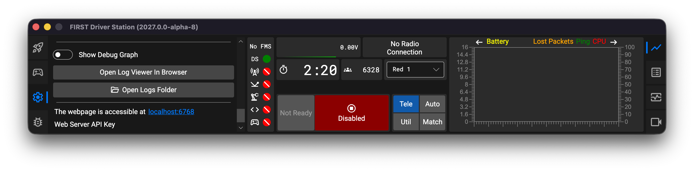
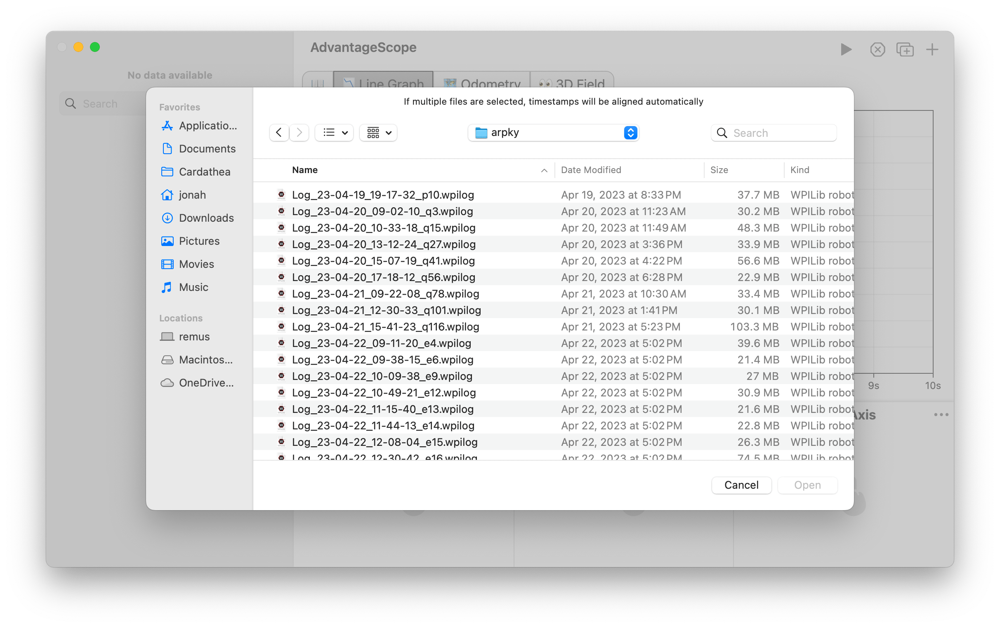
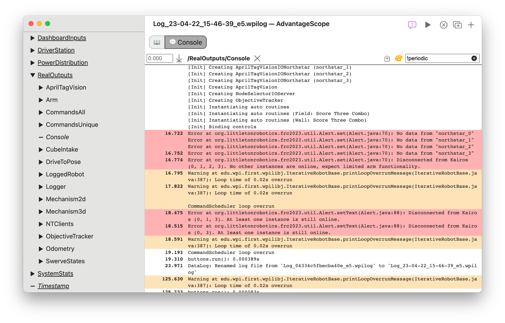
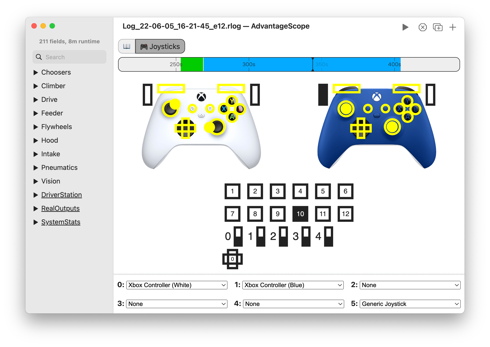

# 🕹️ Taking Control: DS & Joysticks

Understanding driver inputs and communication health is critical when debugging on-field issues. AdvantageScope provides seamless integration with the [FIRST Driver Station](https://docs.wpilib.org/en/latest/docs/software/firstdriverstation), allowing you to monitor live diagnostics, inspect Driver Station logs, and visualize controller inputs.

In this tutorial, you will learn how to:

- Access AdvantageScope directly from the **FIRST Driver Station**.
- Connect to live Driver Station diagnostics.
- Compare and synchronize **on-robot logs** with **Driver Station logs**.
- View console outputs and error messages in the **💬 Console** tab.
- Visualize joystick inputs and controller layouts in the **🎮 Joysticks** tab.

## 1. Accessing AdvantageScope from the FIRST Driver Station

💡 [AdvantageScope Lite](/more-features/advantagescope-lite) is integrated directly with the FIRST Driver Station. It can be accessed by clicking the ⚙️ icon and then "Open Log Viewer in Browser".

## 2. Connecting to the Driver Station Live

When running on the same laptop as the FIRST Driver Station, the AdvantageScope desktop app can also stream live telemetry and diagnostics about the Driver Station status:

1. Launch both the FIRST Driver Station and AdvantageScope.
2. In the top menu, select `File` > `Connect to Driver Station`.
3. AdvantageScope will connect to the local Driver Station service to stream real-time match state, battery voltage, joystick states, etc.
4. Open the 📉 [Line Graph](/tab-reference/line-graph) or 🔢 [Table](/tab-reference/table) tab to view live DS diagnostics.

:::tip
You can also use the keyboard shortcut `Ctrl+Option+Shift+K` (macOS) or `Ctrl+Alt+Shift+K` (Windows/Linux) to quickly connect to the Driver Station as a live source.
:::

## 3. Driver Station Logs vs. On-Robot Logs

When diagnosing robot behavior after a match or practice session, there are two primary log types to consider:

| Log Type                | Source                          | Data Recorded                                                                                                                                                   |
| :---------------------- | :------------------------------ | :-------------------------------------------------------------------------------------------------------------------------------------------------------------- |
| **On-Robot Logs**       | Systemcore via `DataLogManager` | High-frequency telemetry (50+ Hz), robot state, joystick state, sensor measurements, motor currents, PID controller states, pose estimates, and mechanism data. |
| **Driver Station Logs** | Driver Station Laptop           | Network trip time (latency), packet loss %, radio ping, battery voltage, robot controller CPU %, console data, robot state, and joystick state.                 |

:::important On-Robot Logs are Generally Preferred
Because **on-robot logs** record rich, high-frequency telemetry directly at the source, they are generally preferred for investigating robot behavior, control loops, and autonomous paths. However, **DS logs** capture critical external network and match events that the robot cannot measure on its own.

Joystick data is captured in **both logs**, as shown [below](#6-visualizing-joysticks).
:::

## 4. Merging and Synchronizing Multiple Logs

AdvantageScope allows you to open and synchronize logs from multiple sources on a single timeline:

1. Open your on-robot log file using `File` > `Open Log(s)...` (or drag the `.wpilog` file directly into AdvantageScope).
2. In the menu bar, select `File` > `Add New Log(s)...` and select the corresponding Driver Station log (`.dslog`).
3. AdvantageScope will automatically align both logs to a synchronized timeline! The fields from each log are organized under distinct tables (e.g. `Log0` and `Log1`).
4. You can now overlay on-robot telemetry (like motor current or pose estimates) directly against Driver Station signals (like packet loss or battery voltage) in the 📉 [Line Graph](/tab-reference/line-graph) to see if an unexpected robot behavior coincided with a radio drop or brownout.

## 5. Viewing Console Data

The 💬 [Console](/tab-reference/console) tab allows you to view text output and error logs printed by the robot or Driver Station. Console data can be saved in either log file:

- **On-Robot Logs :** WPILib's `DataLogManager` records robot console output automatically.
- **Driver Station Logs:** In the DS, console output and system event messages are saved in the `DS:/Dscomm/Console` field.

To view console data:

1. Click the **+** button in the tab bar and select **Console**.
2. From the sidebar, drag the console field (`DS:/Dscomm/Console` or `messages`) into the main view.
3. Each row represents a log message with its timestamp. Click any message to jump the synchronized timeline across all open tabs to that exact moment!
4. Use the "Filter" box (or press `Ctrl+F` / `Cmd+F`) to search for specific messages, or click the color palette icon to toggle highlighting for warnings and errors.

## 6. Visualizing Joysticks

The 🎮 [Joysticks](/tab-reference/joysticks) tab provides a real-time visual representation of up to 6 game controllers, showing axis movements, trigger pulls, POV hats, and button presses on realistic controller layouts. To ensure joystick inputs are recorded in your on-robot log file, initialize `DriverStation.startDataLog()` in your `Robot` constructor alongside `DataLogManager` as shown in 👋 [Hello, Telemetry!](/tutorials/hello-telemetry).

1. Click the **+** button in the top tab bar and select **Joysticks**.
2. In the table at the bottom of the tab, assign each joystick ID (0 to 5) to the appropriate layout (e.g. **Xbox Controller**, **PS4 Controller**, or **Generic Joystick**).
3. As you scrub through a log file or stream live data from the Driver Station, buttons will light up and thumbsticks will move in sync with the driver's actions!

## What's Next?

Congratulations! You have completed the core AdvantageScope tutorial series. You now know how to:

- Set up telemetry, connect to live streams, and view graphs/tables in **👋 [Hello, Telemetry!](/tutorials/hello-telemetry)**.
- Visualize 2D/3D odometry, trajectories, and mechanisms in **🤖 [To the Field](/tutorials/to-the-field)**.
- Stream Driver Station diagnostics, merge multi-source logs, and replay joystick inputs in **🕹️ [Taking Control](/tutorials/taking-control)**.

Continue exploring AdvantageScope's advanced tools and features:

- **📂 [Log Files](/overview/log-files)**: Learn about supported log formats, exporting data, and batch downloads.
- **🛜 [Live Sources](/overview/live-sources)**: Detailed guide on connecting to live sources, including tuning mode.
- **[Tab Reference](/category/tab-reference)**: Reference guides on the features of every visualization type.
- **[More Features](/category/more-features)**: Documentation and theory on additional features of AdvantageScope.
