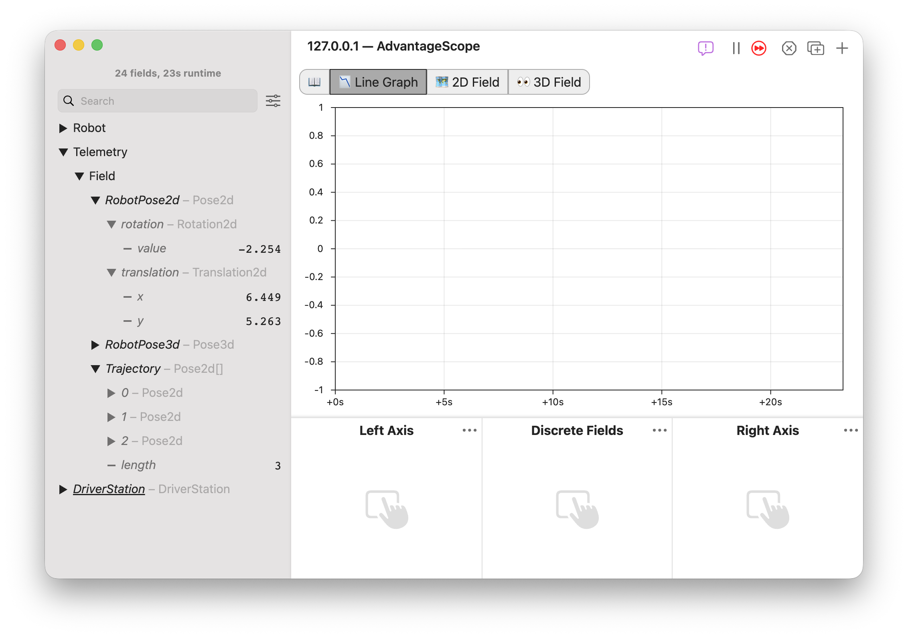
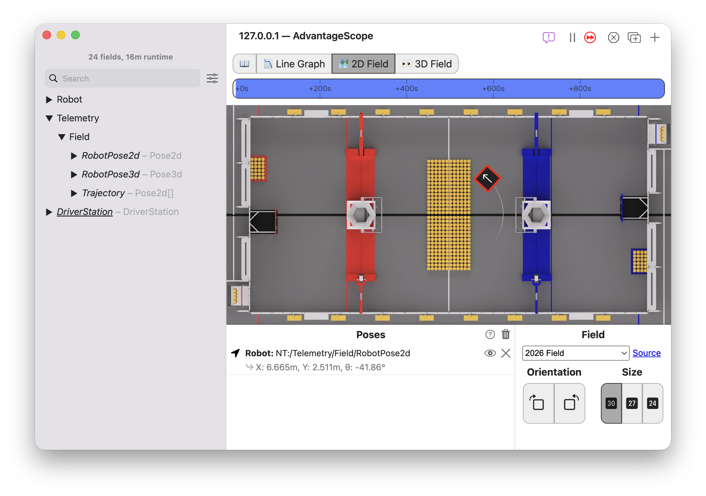
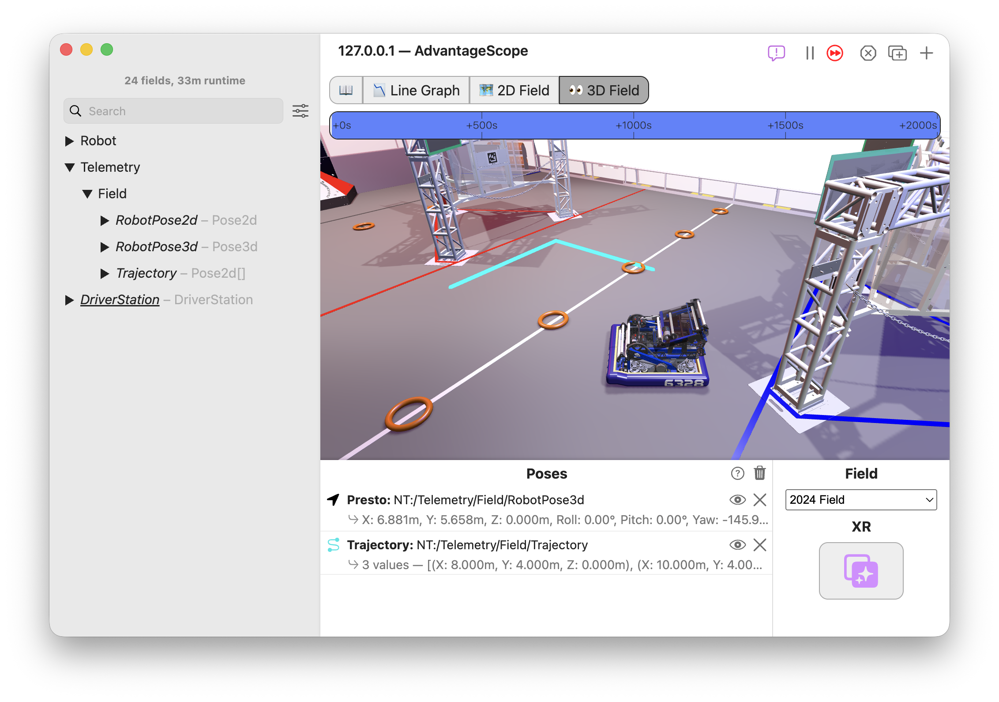
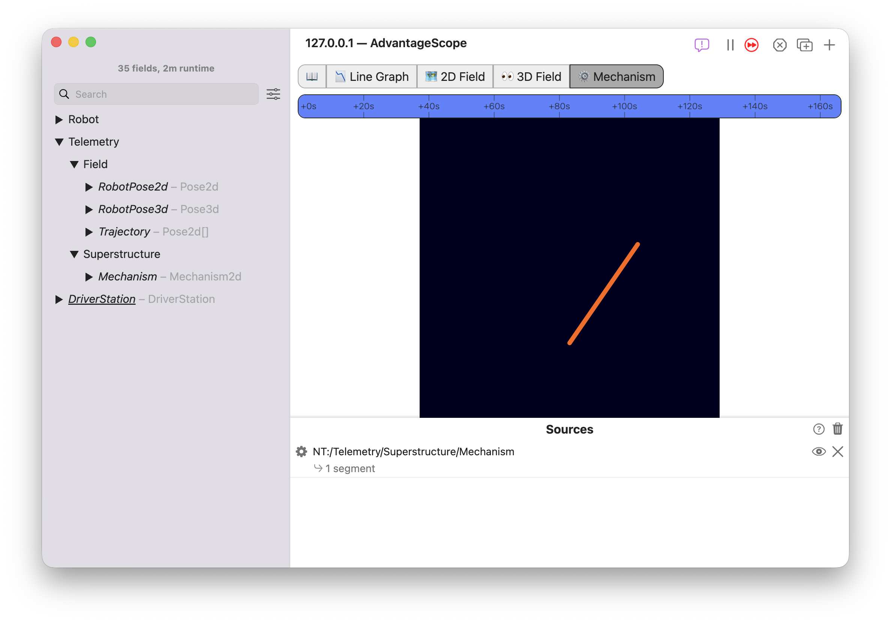
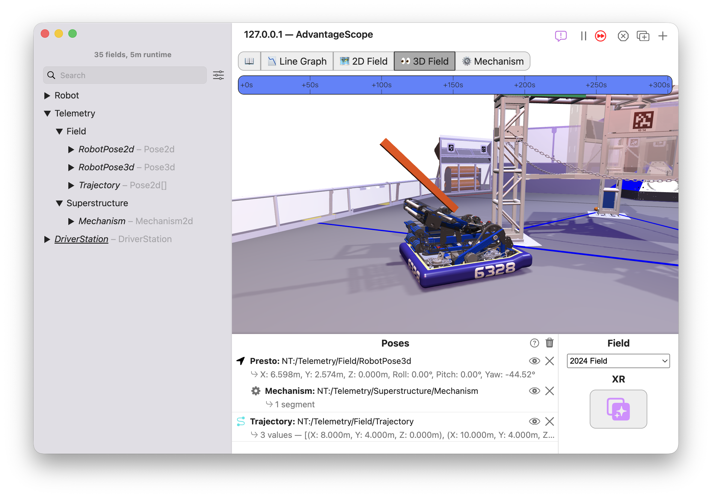

import Image3 from "./img/to-the-field-3.png";

# 🤖 To the Field: Robot Visualization

Now that you have basic telemetry running, it's time to visualize your robot! AdvantageScope provides powerful 2D and 3D field viewers that bring odometry, vision estimates, trajectories, and articulated mechanisms to life on FRC & FTC field models.

In this tutorial, you will learn how to:

- Publish structured pose data using the **Telemetry API**.
- Use the **🗺️ 2D Field** and **👀 3D Field** tabs to visualize robot motion.
- Publish and render a mechanism in both 2D and 3D.

## 1. Publishing Poses

In WPILib, geometry objects like `Pose2d`, `Pose3d`, and `Translation2d` are used to represent the location of the robot and field elements. With the **Telemetry API**, you can log poses/translations and arrays (such as planned paths or vision targets) directly with a single method call:

```java
Pose2d poseA = new Pose2d();
Pose2d poseB = new Pose2d();

Telemetry.log("MyPose", poseA);
Telemetry.log("MyPoseArray", new Pose2d[] {poseA, poseB});
```

<details>
<summary>Sample OpMode</summary>

Want to try AdvantageScope's visualization features without a full robot project? Copy the OpMode below, which publishes several 2D and 3D poses for demonstration purposes on an FRC field model. See 👋 [Hello, Telemetry!](/tutorials/hello-telemetry) for details on creating a new WPILib project and configuring it for telemetry.

```java
@Teleop
public class ExampleTeleop implements OpMode {
  @Override
  public void periodic() {
    double t = Timer.getTimestamp();

    // Generate a sample circular driving trajectory
    double x = 8.0 + 2.0 * Math.cos(t * 0.5);
    double y = 4.0 + 2.0 * Math.sin(t * 0.5);
    Rotation2d rotation = Rotation2d.fromRadians(t * 0.5 + Math.PI / 2.0);
    Pose2d robotPose2d = new Pose2d(x, y, rotation);

    // Create a sample 3D pose (e.g. from vision localization or gyro pitch/roll)
    Pose3d robotPose3d = new Pose3d(x, y, 0.0, new Rotation3d(0.0, 0.0, rotation.getRadians()));

    // Create a sample trajectory (an array of Pose2d objects)
    Pose2d[] trajectory = new Pose2d[] {
        new Pose2d(8.0, 4.0, Rotation2d.ZERO),
        new Pose2d(10.0, 4.0, Rotation2d.ZERO),
        new Pose2d(10.0, 6.0, Rotation2d.CW_PI_2)
    };

    // Log individual 2D and 3D poses
    Telemetry.log("Field/RobotPose2d", robotPose2d);
    Telemetry.log("Field/RobotPose3d", robotPose3d);

    // Log an array of poses (e.g. trajectory or AprilTag poses)
    Telemetry.log("Field/Trajectory", trajectory, Pose2d.struct);
  }
}
```

</details>

In AdvantageScope, geometry values in the sidebar are labeled with their type. You can also expand each field to examine the individual components of the pose such as the X, Y, and rotation values:



## 2. Visualizing 2D Data

The 🗺️ [2D Field](/tab-reference/2d-field) tab displays a top-down view of your robot overlaid onto the competition arena.

1. In AdvantageScope, click the **+** button in the tab bar and select **2D Field** (or select an existing 2D field tab).
2. From the "Field" dropdown in the bottom control pane, select the current game season or an evergreen field.
3. In the sidebar tree, find `NT:/Telemetry/Field/RobotPose2d` and drag it into the "Poses" list in the control pane.
4. Your robot will appear on the field!
5. Click the icon next to the pose in the control pane to change the robot's color.

:::info Camera Controls

Right-click anywhere on the field canvas to choose between **Unlocked**, **Locked to Robot** (pans with the robot), or **Locked to Robot & Rotation** (rotates the field so your robot always points up). Click the buttons under "Orientation" to adjust the rotation.
:::



## 3. Switching Object Types

AdvantageScope supports many visual object types beyond simple robot poses, including ghosts (translucent robots), trajectories, vision targets, heatmaps, AprilTags, game pieces, and more! To explore what object types AdvantageScope can render:

1. Click the `?` (Help) icon located in the control pane.
2. A window will open listing all supported visual types, their expected data types (e.g. `Pose2d`, `Pose3d[]`, `Translation2d`), and whether they can be added as standalone items or as children attached to another object.

Click the icon next to each pose in the control pane to switch the object type. Try switching the robot pose to a different object type like a ghost, arrow, or heatmap!


## 4. Visualizing 3D Data

The 👀 [3D Field](/tab-reference/3d-field) tab renders a 3D field complete with game elements, lighting, and customizable robot models.

1. Click **+** in the tab bar and select **3D Field** (or select an existing 3D field tab).
2. Select your game season model from the "Field" dropdown.
3. Drag `NT:/Telemetry/Field/RobotPose3d` or `NT:/Telemetry/Field/RobotPose2d` into the "Poses" section. (2D poses are automatically placed on the field floor).
4. Drag `NT:/Telemetry/Field/Trajectory` into the "Poses" list and set its type to **Trajectory** to render a path as a ribbon across the field.
5. Click and drag with the **left mouse button** to rotate the camera around the field. Drag with the **right mouse button** to pan. Scroll to zoom.
6. Alternatively, use **WASD** to translate, **IJKL** to rotate, and **Q/E** to move up and down.
7. Right-click the 3D viewport to switch between **Orbit Robot**, **Driver Station** (view the match from your alliance perspective), and **Fixed Camera** (view from on-robot vision cameras).



## 5. Publishing Mechanism Data

If your robot has jointed structures like an elevator, arm, or wrist, you can visualize them using WPILib's `Mechanism2d`. Check the WPILib [documentation](https://docs.wpilib.org/en/stable/docs/software/dashboards/glass/mech2d-widget.html) for details. An example is shown below for a single-jointed arm.

```java
public class ExampleTeleop implements OpMode {
  // Create a 2D mechanism canvas (width 2 m, height 2 m)
  private final Mechanism2d mechanism = new Mechanism2d(2.0, 2.0);
  private MechanismLigament2d arm;

  public ExampleTeleop(Robot robot) {
    // Create an arm rooted at (1 m, 0.5 m)
    MechanismRoot2d root = mechanism.getRoot("ArmRoot", 1.0, 0.5);
    arm = root.append(new MechanismLigament2d("Arm", 0.8, 0.0, 6.0, new Color8Bit(255, 100, 0)));
  }

  @Override
  public void periodic() {
    // Animate the arm angle
    double angle = 45.0 + 45.0 * Math.sin(Timer.getTimestamp() * 2.0);
    arm.setAngle(angle);

    // Publish the mechanism state every loop cycle
    Telemetry.log("Superstructure/Mechanism", mechanism);
  }
}
```

## 6. Visualizing Mechanisms in 2D

The ⚙️ [Mechanism](/tab-reference/mechanism) tab can be used to visualize mechanisms in 2D.

1. Click **+** in the tab bar and select **Mechanism**.
2. Drag `NT:/Telemetry/Superstructure/Mechanism` into the control pane. You will see the animated 2D arm move in real time.



## 7. Visualizing Mechanisms in 3D

You can project this same `Mechanism2d` directly onto your robot in the 3D field tab!

1. On the 3D field tab, make sure your robot pose is added to the "Poses" list.
2. Drag `NT:/Telemetry/Superstructure/Mechanism` **onto the robot pose entry** in the object list (as a child object).
3. The 2D mechanism is projected into 3D space on the robot chassis! Click the gear icon next to the mechanism to toggle between the **XZ** (side profile) and **YZ** (front profile) planes.



## What's Next?

Now that you can visualize your robot's motion and mechanisms in 2D and 3D:

- **🕹️ [Taking Control: DS & Joysticks](/tutorials/taking-control)**: Learn how to integrate with the FIRST Driver Station, work with DS logs, and visualize controller inputs.
- **👀 [3D Field](/tab-reference/3d-field)**: A comprehensive guide to the 3D field tab, including game piece visualization, camera options, and rendering modes.
- **[AdvantageScope XR](/tab-reference/3d-field/advantagescope-xr)**: Bring the 3D field view to life in augmented reality on iPhone and iPad.
- **🎬 [Video](/tab-reference/video)**: Compare your field visualization side-by-side with real match footage.
- **🦀 [Swerve](/tab-reference/swerve)**: Visualize the state of swerve drive mechanisms, including overlays on the 2D and 3D fields.
- **⚙️ [Custom Assets](/more-features/custom-assets)**: Add custom CAD models, articulated mechanisms, and field images/models.
