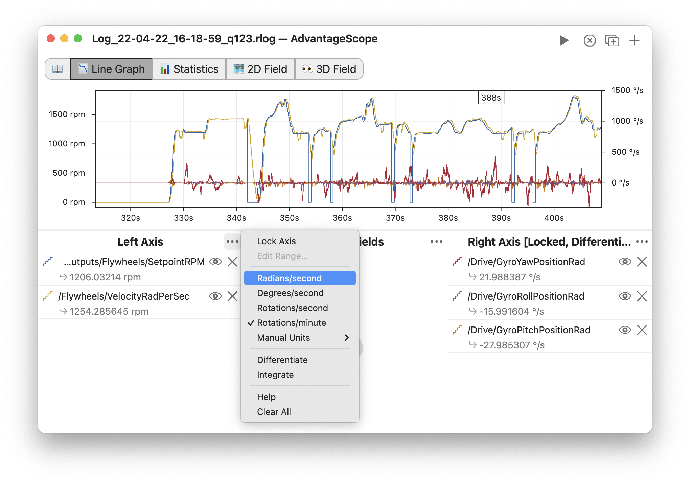
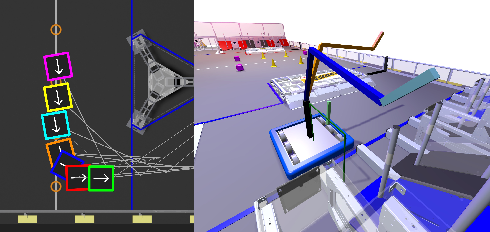
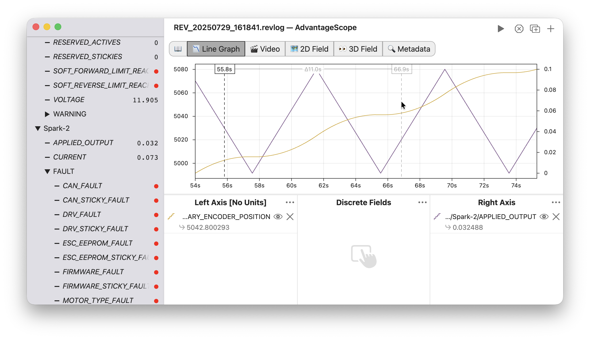
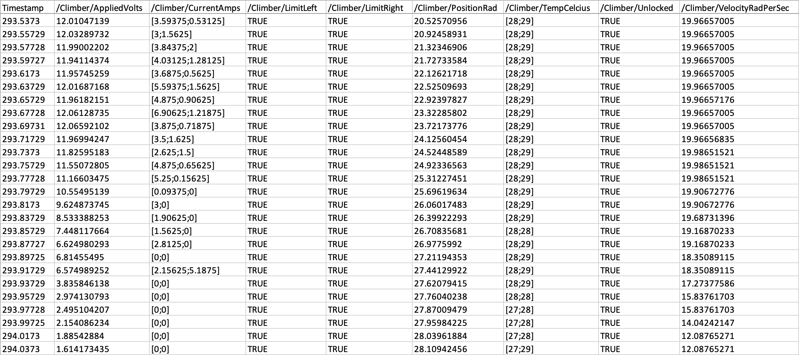
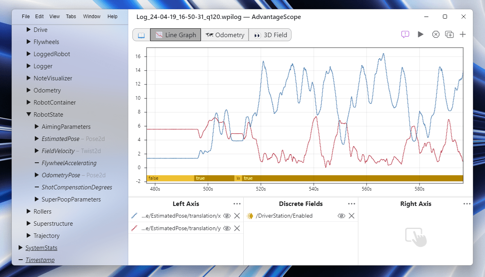

import BannerLight from "./img/whats-new/banner-light.png";
import BannerDark from "./img/whats-new/banner-dark.png";

import FTC1 from "./img/whats-new/ftc-1.jpg";
import FTC2 from "./img/whats-new/ftc-2.jpg";
import FTC3 from "./img/whats-new/ftc-3.png";
import FTC4 from "./img/whats-new/ftc-4.png";
import FTC5 from "./img/whats-new/ftc-5.png";
import Subfolders from "./img/whats-new/subfolders.png";
import Menus1 from "./img/whats-new/menus-1.png";
import Menus2 from "./img/whats-new/menus-2.png";
import Menus3 from "./img/prefs.png";

#

The 2026 version of AdvantageScope is now available! Check the [installation docs](/overview/installation) and [full changelog](https://github.com/Mechanical-Advantage/AdvantageScope/releases) for details. This release includes several major new features and numerous enhancements across the application. Many of the features in this release are designed to improve the experience on existing control systems while setting up a smooth transition to [Systemcore](https://community.firstinspires.org/march-updates-on-the-future-robot-controller) in future seasons.

**We value your feedback! Feedback, feature requests, and bug reports are welcome on the [issues page](https://github.com/Mechanical-Advantage/AdvantageScope/issues).**

## ✴️ Experimental: FTC Support {#ftc-support}

In preparation for full support with Systemcore in the 2027-2028 season, this release adds several features to improve compatibility with the existing FIRST Tech Challenge control system:

- FTC fields and robot models on the 🗺️ [2D Field](/tab-reference/2d-field) and 👀 [3D Field](/tab-reference/3d-field)
- New [coordinate system](/more-features/coordinate-systems) options for compatibility with [standard FTC coordinates](https://ftc-docs.firstinspires.org/en/latest/game_specific_resources/field_coordinate_system/field-coordinate-system.html)
- Support for [Road Runner](https://rr.brott.dev/docs/v1-0/installation/) log files
- Support for the [FTC Dashboard](https://github.com/acmerobotics/ftc-dashboard) live streaming format

:::tip
FTC teams should exercise caution when using experimental software during the official season. FTC support for AdvantageScope is still in active development.
:::

  
  
  
  
  

Several third-party FTC logging/telemetry libraries support other formats compatible with AdvantageScope, such as WPILOG and RLOG. Documentation of these libraries can be found in the respective projects; the AdvantageScope developers do not endorse/recommend any particular FTC logging solution for use with AdvantageScope.

:::info
AdvantageScope is designed to provide the best experience when used alongside the WPILib framework and associated logging tools. You may encounter compatibility issues or limited capabilities when using unofficial logging solutions.

All features of AdvantageScope will be officially supported in FTC after the transition to Systemcore for the 2027-2028 season.
:::

## 🧮 Unit-Aware Graphing {#unit-aware-graphing}

The 📉 [Line Graph](/tab-reference/line-graph/) tab has been redesigned to be fully unit-aware. This enables several new capabilities when graphing numeric fields:

- Precise labeling of Y axes and value displays
- Quick conversion to compatible units (no popup windows)
- Implicit conversion of compatible unit types within a single axis
- Accurate display of [integrated and differentiated](/tab-reference/line-graph/#integration--differentiation) units

The screenshot below shows all of these features in action. Note that the left axis includes fields with different angular velocity units, and the right axis includes values that are differentiated and displayed in a non-native unit (degrees). Selecting units is also easier than ever before, with compatible unit options integrated directly in the control menu for each axis.

_More information about unit support can be found in the [documentation](/tab-reference/line-graph/units)._

## 🏁 Faster Log Downloads {#faster-log-downloads}

[Downloading logs from the roboRIO](/overview/log-files/#downloading-from-the-robot) is now **2-4x faster** than previous releases. This is accomplished by switching to a new protocol (FTP) that allows the roboRIO to transfer log data with less CPU overhead.

The table below shows the measured transfer speed on the 2025 and 2026 releases of AdvantageScope while tethered via Ethernet (max bandwidth of 100 Mb/s). Note that the performance of the 2025 release is severely impacted by the CPU load on the roboRIO.

|                                                    | 2025 (SFTP) | 2026 (FTP) | Speedup                                          |
| -------------------------------------------------- | ----------- | ---------- | ------------------------------------------------ |
| High CPU load Complex robot code   | 25 Mb/s     | 80 Mb/s    | **3.2x** |
| Average CPU load Normal robot code | 40 Mb/s     | 90 Mb/s    | **2.3x** |
| Minimal CPU load No robot code     | 90 Mb/s     | 95 Mb/s    | **1.1x** |

## 📁 Download Logs From Subfolders {#download-logs-from-subfolders}

The download window now supports saving logs that are stored in subfolders. Each subfolder of logs can be downloaded as a group, providing a streamlined approach for downloading logs generated by the 2026 release of CTRE's [Signal Logger](https://v6.docs.ctr-electronics.com/en/stable/docs/api-reference/api-usage/signal-logging.html) (which uses subfolders as a workaround for being unable to store data in a single log file).

## 🌈 New Visualization Options {#new-visualization-options}

Several new visualization options are supported on the 🗺️ [2D Field](/tab-reference/2d-field) and 👀 [3D Field](/tab-reference/3d-field):

- A wider variety of robot bumper colors are now available on the 2D field, and each object can be configured with its own color. This enables greater flexibility when combining ghosts with multiple robot objects.
- When [visualizing 2D mechanisms on the 3D field](/tab-reference/3d-field/#2d-mechanisms), mechanisms can now be placed on the YZ plane in addition to the XZ plane. This enables easier visualization of complex mechanisms with movement in multiple axes.
- The 3D field now supports optional anti-aliasing to improve the quality of rendered edges.

## 🪵 REV Robotics CAN Log Support {#rev-robotics-can-log-support}

You can now open `.revlog` files produced by REV Robotics' [`StatusLogger`](https://codedocs.revrobotics.com/java/com/revrobotics/util/statuslogger) directly in AdvantageScope. These files record CAN signals from Spark Max and Spark Flex devices, offering an official alternative to AdvantageScope's [URCL](/more-features/urcl) library.

Both URCL and the official `StatusLogger` will remain available during the 2026 season to ensure a smooth transition and provide feature parity with previous seasons. We will have more details to share about logging options in 2027 and beyond at a later date.

## 💿 CSV File Imports {#csv-file-imports}

For more flexible visualization of data produced outside of robot logging frameworks, AdvantageScope now includes basic support for importing CSV files. Check the [documentation](/overview/log-files/#csv-formatting) for more details on supported formats and other limitations.

## 🤩 Aesthetic Improvements {#aesthetic-improvements}

The AdvantageScope UI on Windows 11 has been updated to support a translucent sidebar, which was previously exclusive to macOS releases. An updated app icon is also available for macOS Tahoe based on Apple's Liquid Glass material.

## 📋 Streamlined Menus {#streamlined-menus}

The menu bar and related controls have been streamlined and reorganized to make the controls more accessible and consistent across all platforms. Notable features include:

- Faster switching between live sources (e.g. NetworkTables and [Phoenix Diagnostics](/overview/live-sources/phoenix-diagnostics)), with no need to open the preferences window.
- Right-click on the sidebar to quickly copy the name of a field (or the full field key).
- Reorganization of the preferences window, making options easier to find quickly.

  
  
  

## 🐛 Stability Improvements {#stability-improvements}

This release includes a variety of bug fixes and stability improvements across the application. The full list can be found in the release [changelog](https://github.com/Mechanical-Advantage/AdvantageScope/releases), but some notable fixes are listed below:

- The performance of AdvantageScope when streaming data for long periods has been greatly improved, especially when using the line graph tab.
- AdvantageScope is now more tolerant of unusual log data, including large log files and large field values.
- Various visual glitches have been fixed when browsing log data, especially when using filters on the line graph tab.
- The ordering of AdvantageKit log files in the download window has been fixed; logs without timestamps are now at the bottom of the list, similar to other formats.
- On the 3D field tab, robot cameras with a nonzero rotation in the roll axis are now visualized correctly.
- The stability of AdvantageScope XR has been improved, especially when running on iOS/iPadOS 26. For offline installations, check the App Store for available updates.
