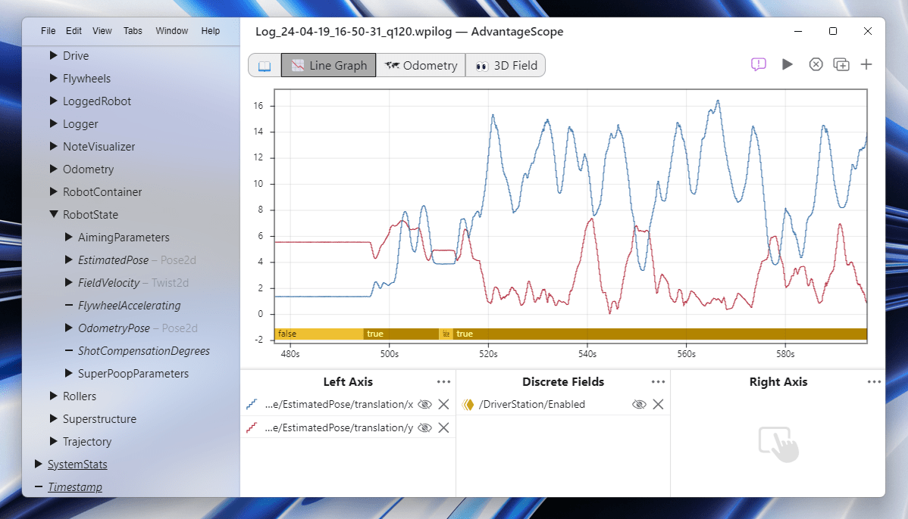

# AdvantageScope 2026: New Horizons

The 2026 version of AdvantageScope is now available, with some exciting updates including **experimental support for FIRST Tech Challenge!** Check the [full changelog](https://github.com/Mechanical-Advantage/AdvantageScope/releases/tag/v26.0.0-beta-1) for a complete list. Some of the most notable new features are explained below.

## ✴️ Experimental: FTC Support

## 🏁 Faster Log Downloads

## 🧮 All-New Unit Handling

Line graph units
New unit types (bytes, bandwidth, voltage, current)

## 🌈 New Visualization Options

Robot bumper colors
2D mechanisms on YZ axis
3D antialiasing

## 📋 Streamlined Menus

Reorganization (consistency across platforms)
Live source switching
Right-click to copy fields
Preferences window organization

## 📐 Flexible Coordinate Systems

## 🤩 Aesthetic Enhancements

The AdvantageScope UI on Windows 11 has been updated to support a translucent sidebar, which was previously exclusive to macOS releases. An updated app icon is also available for macOS Tahoe based on Apple's Liquid Glass material.

## 💿 CSV File Imports

## 🐛 Improved Stability

Live streaming performance
Handling of large logs and field values
Various visual glitches when browsing data
Fixed ordering of AdvantageKit logs in download window
