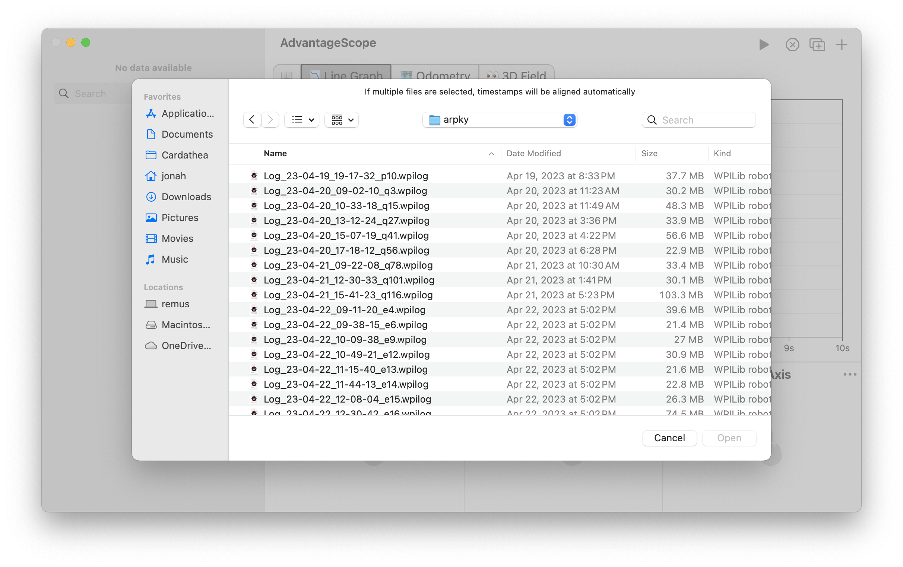

import PrefsImage from '../img/prefs.png';
import Image2 from './img/open-file-2.png';

# Managing Log Files

## Supported Formats

- **WPILOG (.wpilog)** - Produced by WPILib's [built-in data logging](https://docs.wpilib.org/en/stable/docs/software/telemetry/datalog.html) and AdvantageKit. [URCL](../more-features/urcl.md) can be used to capture signals from REV motor controllers to a WPILOG file.
- **Driver Station logs (.dslog and .dsevents)** - Produced by the [FRC Driver Station](https://docs.wpilib.org/en/stable/docs/software/driverstation/driver-station.html). AdvantageScope automatically searches for the corresponding log file when opening either log type.
- **Hoot (.hoot)** - Produced by CTRE's Phoenix 6 [signal logger](https://pro.docs.ctr-electronics.com/en/latest/docs/api-reference/api-usage/signal-logging.html).
- **RLOG (.rlog)** - Legacy, produced by AdvantageKit 2022.

:::warning
Hoot files can **only be opened on Windows** and require an installation of [Phoenix Tuner X](https://v6.docs.ctr-electronics.com/en/stable/docs/tuner/index.html).
:::

## Opening Logs

In the menu bar, click `File` > `Open Log(s)...`, then choose a one or more log files from the local disk. Dragging a log file from the system file browser to the AdvantageScope icon or window also causes it to open.

:::info
If multiple files are opened simultaneously, the timestamps will be aligned automatically. This enables easy comparison of log files from multiple sources.
:::

## Adding New Logs

After opening a log file, additional logs can be easily added to the visualization. Timestamps will be realigned automatically to synchronize with existing data.

In the menu bar, click `File` > `Add News Log(s)...`, then choose a one or more log files to add to the current visualization. The fields from each log will be recorded under tables named `Log0`, `Log1`, etc.

## Downloading from a roboRIO

Configuration

Open the preferences window by clicking `Help` > `Show Preferences...` (Windows/Linux) or `AdvantageScope` > `Settings...` (macOS). Update the roboRIO address and log folder. Click `File` > `Use USB roboRIO Address` to temporarily use the IP address `172.22.11.2` for all connections.

Click `File` > `Download Logs...` to open the download window. Once connected to the roboRIO, available logs are shown with the newest at the top. Select one or more log files to download (shift-click to select a range or **cmd/ctrl + A** to select all). Then click the ↓ symbol and select a save location.

:::tip
When downloading multiple files, AdvantageScope skips any that already exist in the destination folder.
:::

