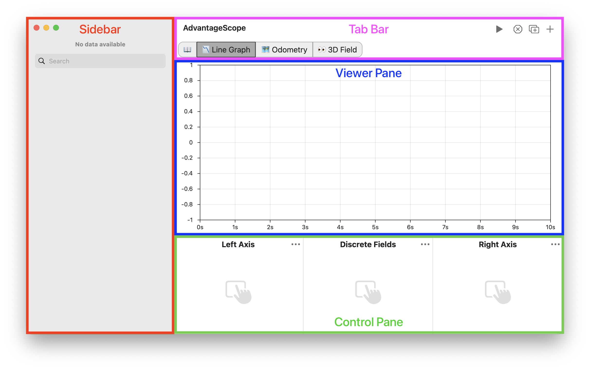

# App Navigation

The screenshot below shows the important elements of the main AdvantageScope window. The exact appearance differs between operating systems.

:::tip
To view multiple log files simultaneously, click `File` > `New Window`.
:::

## Sidebar

To the left is the sidebar with the list of available tables and fields. Selectable fields are shown in _italics_ and built-in tables (from WPILib or AdvantageKit) are <u>underlined</u>. Click the arrow to expand nested tables. **Drag a single field** to select it or **hold cmd/ctrl** to select a collection of fields by clicking each one. Start dragging the collection of fields to finish the selection.

To search for a field, begin typing in the search box. A dropdown of fields will display, then the selected field will be highlighted in the sidebar and scrolled into view.

:::info
Click and drag on the right edge to resize or hide the sidebar. Double-click to toggle the sidebar visibility.
:::

## Tab Bar

Use the tab bar (blue) to switch between different views. This documentation is available at any time by clicking the 📖 icon to the left. To export the current tab layout (and associated settings), click `File` > `Export Layout...` To import a layout from a file, click `File` > `Import Layout...`

:::info
Tabs can be rearrange by clicking and dragging, or renamed by right-clicking and selecting `Rename...`
:::

The navigation buttons (green) on the top manage the tabs and control playback.

- **Plus Button**: Opens a dropdown menu to create a new tab.
- **Window Button:** Creates a new pop-out window with the tab tab. This feature can be used to view data from multiple tabs simultaneously.
- **X Button:** Closes the current tab.
- **Play Button:** Start and stop real-time playback. _Right-click to change playback speed._

## Viewer Pane

The viewer pane is where data is presented for each tab type. Check the tab reference documentation for details on the viewer pane for tab. This view can be moved to a separate window by clicking the pop-out button in the tab bar.

## Control Pane

The control pane is used to select fields for visualization and manage other options. Check the tab reference documentation for details on the options available for each tab.

:::info
Click and drag on the top edge to resize or hide the control pane. Double-click to toggle the control pane visibility.
:::
