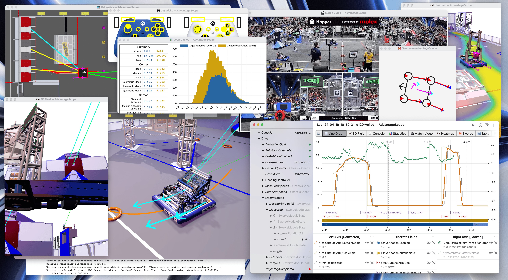

# AdvantageScope

import DocCardList from "@theme/DocCardList";

AdvantageScope is a robot diagnostics, log review/analysis, and data visualization application for FIRST Robotics Competition teams. It reads logs in WPILOG, DS log, Hoot (CTRE), and RLOG file formats, plus live robot data viewing using NT4 or RLOG streaming. AdvantageScope can be used with any WPILib project, but is also optimized for use with our [AdvantageKit](https://github.com/Mechanical-Advantage/AdvantageKit) log replay framework. Note that **AdvantageKit is not required to use AdvantageScope**.

<DocCardList
  items={[
    {
      type: "category",
      label: "Getting Started",
      href: "/category/getting-started"
    },
    {
      type: "category",
      label: "Tab Reference",
      href: "/category/tab-reference"
    },
    {
      type: "category",
      label: "More Features",
      href: "/category/more-features"
    }
  ]}
/>

AdvantageScope includes the following tools:

- A wide selection of flexible graphs and charts
- 2D and 3D field visualizations of odometry data, with customizable CAD-based robots
- Synchronized video playback from a separately loaded match video
- Joystick visualization, showing driver actions on customizable controller representations
- Swerve drive module vector displays
- Console message review
- Log statistics analysis
- Flexible export options, with support for CSV and WPILOG

<Button
  label="Go to Downloads"
  link="https://github.com/Mechanical-Advantage/AdvantageScope/releases/latest"
  variant="primary"
  size="lg"
  block
  style={{ marginBottom: "15px" }}
/>

Feedback, feature requests, and bug reports are welcome on the [issues page](https://github.com/Mechanical-Advantage/AdvantageScope/issues). For non-public inquires, please send a message to software@team6328.org.

