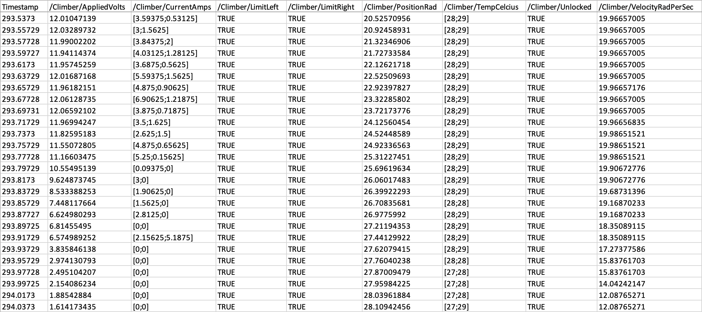

import Image1 from './img/export-1.png';

# Exporting Log Data

AdvantageScope includes a flexible system for exporting log data as a CSV, WPILOG, or MCAP file. The export functions work when viewing a log file or when connected to a live data source. Possible use cases include:

- Converting a WPILOG file to CSV or MCAP for analysis in other applications.
- Exporting a WPILOG file based on NetworkTables data, for later access.
- Saving a WPILOG with a limited number of fields (and duplicate values removed) to reduce file size.

To view options for exporting, click `File` > `Export Data...`.

:::tip
In addition to the full-log export described here, the 💬 [Console](../tab-reference/console.md) tab allows console data to be exported to a text file.
:::

## Options

The following options are provided when exporting:

- **Format:** Sets the general format of the exported file. See options below.
  - _CSV (Table):_ Comma separated values, where each row represents a distinct timestamp and each column represents a field (plus a column for the timestamp value). Each row can represent a value in multiple fields.
  - _CSV (List):_ Comma separated values, where each row represents a value in a single field with columns for timestamp, key, and value.
  - _WPILOG:_ Standard WPILOG file that can be opened again in AdvantageScope.
  - _MCAP:_ Standard [MCAP](https://mcap.dev) file that can be opened in [Foxglove](https://foxglove.dev).
- **Timestamps:** Only for "CSV (Table)". Sets the method for creating new rows. See options below.
  - _All Changes:_ Create new rows/entries only when the values of the fields are updated. Minimizes the file size of the export.
  - _Fixed Period:_ Create new rows/entries at a fixed interval, useful for logs without timestamp synchronization (when many fields are being logged with similar, but not identical, timestamps). Note that all values are included, regardless of whether there was a change between sample points.
  - _AdvantageKit Cycles:_ Create a new row/entry for each AdvantageKit synchronized loop cycle. Note that all values are included, regardless of whether there was a change between loop cycles.
- **Period:** Only when "Fixed Period" is selected. Sets the period in milliseconds between each sample. Typically, this should match the loop cycle period of the robot code.
- **Prefixes:** If blank, include all fields. Otherwise, only include fields that match the prefixes provided (separated with commas). See examples below.
  - "_/DriverStation/Joystick0_": Include all fields starting with "/DriverStation/Joystick0" (data from the first joystick).
  - "_Flywheels,DS:enabled_": Include all fields starting with "/Flywheels" or "DS:enabled" (all data from the flywheel, plus the robot's enabled status).
  - "_Drive/LeftPosition,Drive/RightPosition_": Only include the fields "/Drive/LeftPosition" and "/Drive/RightPosition".
- **Field Set:** See options below. Generated fields are created by AdvantageScope to break down complex types, and are displayed with gray text in the sidebar. This includes the individual components of arrays, structs, and other schemas.
  - _Include Generated:_ Export all viewable fields, which includes generated fields. Recommended if the exported data will be opened in an application not capable of parsing complex types.
  - _Original Only:_ Only export fields that were present in the original log file, which excludes generated fields. Recommended if the exported data will be opened in AdvantageScope or another application capable of parsing complex types.

An example CSV file exported from AdvantageScope is shown below, in the "CSV (Table)" format with timestamps set to "All Changes":

