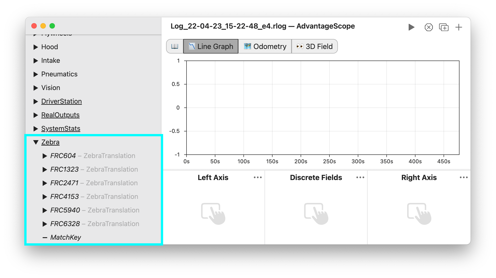
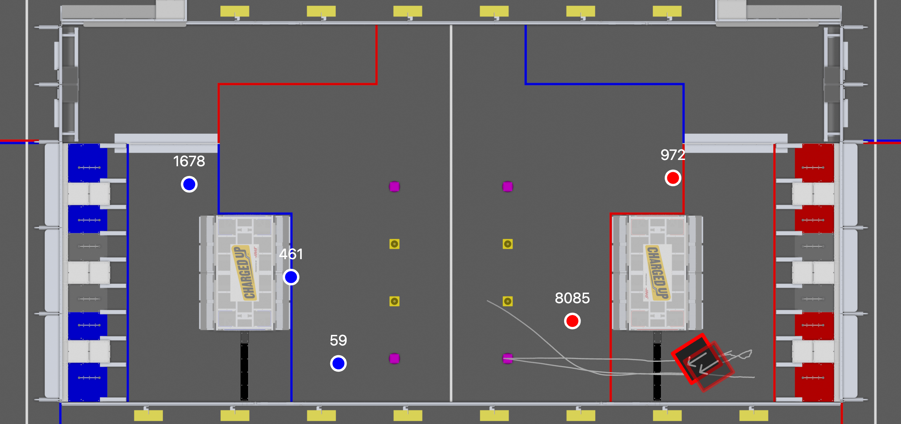
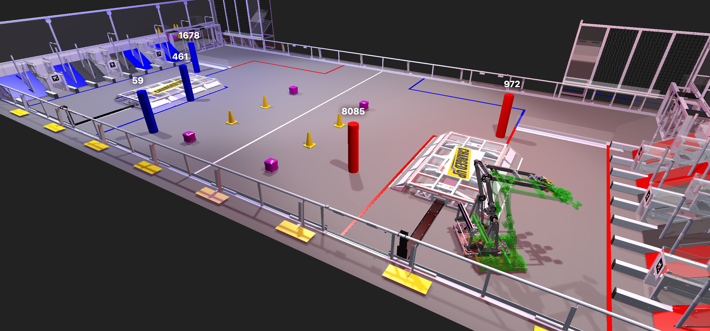

# Loading Zebra MotionWorks™ Data

_This feature is powered by [The Blue Alliance](https://www.thebluealliance.com)._

Zebra MotionWorks™ data is available at some FRC events to track the position of robots throughout the match. For more details, see [here](https://www.firstinspires.org/robotics/frc/blog/2023-zebra-motionworks-for-first-robotics-competition-at-the-first-championship). AdvantageScope can automatically download and merge this data with robot logs.

> Note: This feature requires an API key for The Blue Alliance, which should be obtained at [thebluealliance.com/account](https://www.thebluealliance.com/account) and copied to the AdvantageScope preferences page under "TBA API Key".

To begin, open a robot log for a match with Zebra data available on The Blue Alliance. Then, click "File" > "Load Zebra MotionWorks™". The data will be downloaded and stored under the "/Zebra" table. This includes the TBA match key and translations for each team (Zebra data does not include robot rotations).

Translations can be viewed using the 🗺️ [Odometry](../tab-reference/odometry.md) or 👀 [3D Field](../tab-reference/3d-field.md) tabs. The object type can be "Zebra Marker" or "Ghost". "Zebra Marker" displays a simple marker with a team number annotation, and "Ghost" displays a translucent robot which matches the rotation of a provided robot pose (useful for comparing Zebra data to the robot's onboard localization).

