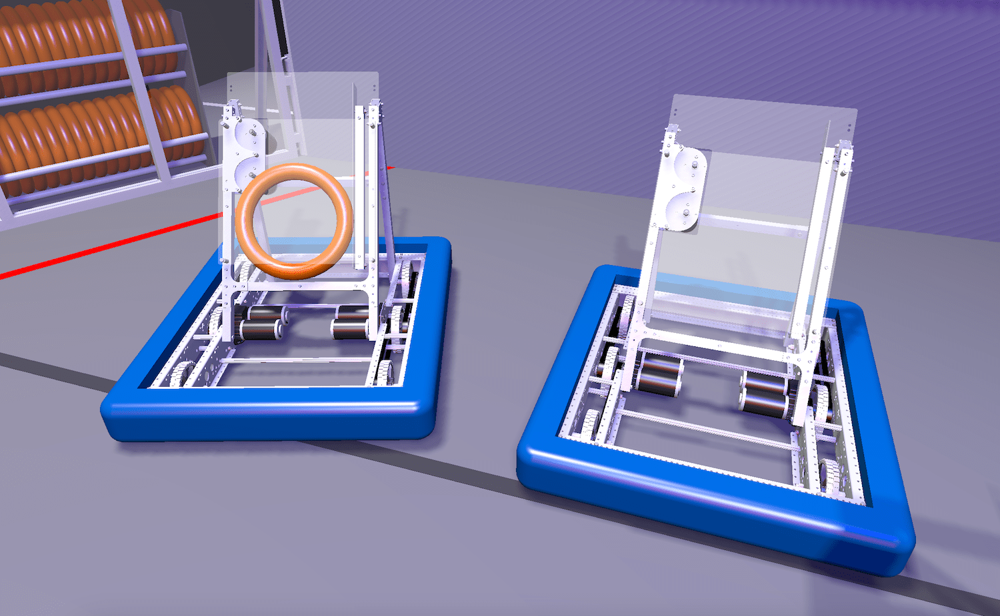
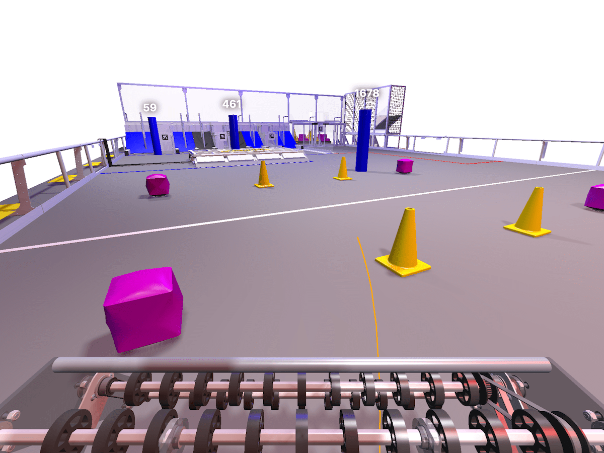

import Tabs from '@theme/Tabs';
import TabItem from '@theme/TabItem';
import PrefsImage from '../img/prefs.png';

# 👀 3D Field

The 3D field shows a 3D visualization of the robot and field. It can be used with regular 2D odometry, but is especially helpful when working with 3D calculations (like localizing with AprilTags). Multiple camera views are available, including field relative, robot relative, and fixed. The timeline shows when the robot is enabled and can be used to navigate through the log data.


<details>
<summary>Timeline Controls</summary>

The timeline is used to control playback and visualization. Clicking on the timeline selects a time, and right-clicking deselects it. The selected time is synchronized across all tabs, making it easy to quickly find this location in other views.

The green sections of the timeline indicate when the robot is autonomous, and the blue sections indicate when the robot is teleoperated.

To zoom, place the cursor over the timeline and scroll up or down. A range can also be selecting by clicking and dragging while holding `Shift`. Move left and right by scrolling horizontally (on supported devices), or by clicking and dragging on the timeline. When connected live, scrolling to the left unlocks from the current time, and scrolling all the way to the right locks to the current time again.


</details>

## Adding Objects

To get started, drag a field to the "Poses" section. Delete an object using the X button, or hide it temporarily by clicking the eye icon or double-clicking the field name. To remove all objects, click the trash can near the axis title and then `Clear All`. Objects can be rearranged in the list by clicking and dragging.

**To customize each object, click the colored icon or right-click on the field name.** AdvantageScope supports a large number of object types, many of which can be customized (such as changing colors and robot models). Some objects must be added as children to an existing object.

:::tip
To see a full list of supported object types, click the `?` icon. This list also includes the supported data types and whether the objects must be added as children.
:::

## Data Format

Geometry data should be published as a byte-encoded struct or protobuf. Various 2D and 3D geometry types are supported, including `Pose2d`, `Pose3d`, `Translation2d`, `Translation3d`, and more.

:::warning
The legacy number array format for geometry data is now deprecated. See [here](../whats-new/legacy-formats.md) for details.
:::

Many FRC libraries support the struct format, including WPILib and AdvantageKit. The example code below shows how to log 3D pose data in Java.

<Tabs>
<TabItem value="wpilib" label="WPILib" default>

```java
Pose3d poseA = new Pose3d();
Pose3d poseB = new Pose3d();

StructPublisher<Pose3d> publisher = NetworkTableInstance.getDefault()
  .getStructTopic("MyPose", Pose3d.struct).publish();
StructArrayPublisher<Pose3d> arrayPublisher = NetworkTableInstance.getDefault()
  .getStructArrayTopic("MyPoseArray", Pose3d.struct).publish();

periodic() {
  publisher.set(poseA);
  arrayPublisher.set(new Pose3d[] {poseA, poseB});
}
```

:::tip
WPILib's [`Field2d`](https://docs.wpilib.org/en/stable/docs/software/dashboards/glass/field2d-widget.html) class can also be used to log several sets of 2D pose data together.
:::

</TabItem>
<TabItem value="advantagekit" label="AdvantageKit">

```java
Pose3d poseA = new Pose3d();
Pose3d poseB = new Pose3d();

Logger.recordOutput("MyPose", poseA);
Logger.recordOutput("MyPoseArray", poseA, poseB);
Logger.recordOutput("MyPoseArray", new Pose3d[] {poseA, poseB});
```

</TabItem>
</Tabs>

## Mechanisms & Components

Mechanism data can be visualized using 2D mechanisms or articulated 3D components.

### 2D Mechanisms

To visualize mechanism data logged using a [`Mechanism2d`](https://docs.wpilib.org/en/stable/docs/software/dashboards/glass/mech2d-widget.html), add the mechanism field to an existing robot or ghost object. The mechanism is projected onto the XZ plane of the robot using simple boxes (as shown below). The robot's origin is centered on the bottom edge of the mechanism.


### 3D Components

:::warning
Setting up 3D components can be complex and time-consuming. Consider utilizing AdvantageScope's `Mechanism2d` support as described above, which offers a more streamlined approach to visualize mechanisms on the 3D field.
:::

Mechanisms can be visualized with articulated components by logging a set of 3D poses that represent the robot-relative locations of each component. Add the poses to an existing robot or ghost object and set the object type to "Component".

Each component can be moved independently (like an elevator carriage, arm, or end effector). For more information on configuring robots with components, see [Custom Assets](../more-features/custom-assets.md).


## Game Piece Objects

Each field includes a set of game piece object types, allowing game pieces to be rendered at any position on the field using data published by the robot code. This has a variety of applications, including:

- Visualizing the actions of simulated auto routines using simple animations
- Showing the detected locations of game pieces on the field
- Indicating where game pieces are located within a robot
- Viewing shot trajectories based on physics calculations

Another simple use case is showing the state of game pieces within the robot based on sensor data. For example, a beam break sensor within the note path for a 2024 robot could cause a note to appear (as shown below).

<details>
<summary>Code Example</summary>

The AdvantageKit KitBot 2024 example project includes a simple example of a [command](https://github.com/Mechanical-Advantage/AdvantageKit/blob/main/example_projects/kitbot_2024/src/main/java/frc/robot/util/NoteVisualizer.java) that animates a note traveling from the robot to the speaker. This command is incorporated into the standard [launch sequence](https://github.com/Mechanical-Advantage/AdvantageKit/blob/main/example_projects/kitbot_2024/src/main/java/frc/robot/subsystems/launcher/Launcher.java#L73), triggering the animation whenever a note is released. [This video](https://youtube.com/shorts/-HxfDo9f19U?feature=share) shows how game piece animations can be used to visualize auto routines for several different games.

</details>



## Camera Options

To switch the selected camera mode, right-click on the rendered field view. The camera mode and position is controlled independently for every pop-up window, allowing for the easy creation of multi-camera views.

:::info
Right-click the rendered field view and click "Set FOV..." to adjust the FOV of the orbiting and Driver Station cameras.
:::

### Orbit Field

This is the default camera mode, where the camera can be freely moved relative to the field. **Left-click + drag** rotates the camera, and **right-click + drag** pans the camera. **Scroll** to zoom in and out.

### Orbit Robot

This mode has the same controls as the "Orbit Field" mode, but the camera's position is locked relative to the robot. This allows for "tracking" shots of the robot's movement.

### Driver Station

This mode locks the camera behind one of the driver stations at typical eye-height. Either manually choose the station to view or choose "Auto" to use the alliance and station number stored in the log data.

:::warning
Automatic selection of station number may be inaccurate when viewing log data produced by AdvantageKit 2023 or earlier.
:::

### Fixed Camera

Each robot model is configured with a set of fixed cameras, like vision and driver cameras. These cameras have fixed positions, aspect ratios, and FOVs. These views are often useful to check vision data or to simulate a driver camera view. In the example below, a driver camera is shown.



If a "Camera Override" pose is provided, it replaces the default poses of all fixed cameras while retaining their configured FOVs and aspect ratios. This allows the robot code to provide the position of a moving camera, like one mounted to a turret or shooter hood.

:::info
Consistent with other pose data, the "Camera Override" pose must be _field relative_, not robot relative.
:::

## Configuration

The following configuration options are available:

- **Field:** The field model to use, defaults to the most recent game. We recommend using the "Evergreen" field for devices with limited graphical performance. The "Axes" field displays only XYZ axes at the origin with a field outline for scale.
- **Origin:** The position of the field origin, on the blue or red alliance wall. Choosing the switch icon will use the current alliance color

:::warning
Automatic selection of alliance color may be inaccurate when viewing log data produced by AdvantageKit 2023 or earlier.
:::

### Rendering Modes

The 3D field supports three rendering modes:

- **Cinematic:** Render using shadows, lighting, reflections, and high-detail 3D models for a more realistic look. Requires a decently powerful GPU.
- **Standard (Default):** Render with minimal lighting and simplified 3D models. Runs well on most devices.
- **Low Power:** Lower the framerate, resolution, and model detail to reduce battery consumption and provide more consistent performance on low-end devices.


To configure the rendering mode, open the preferences window by pressing clicking `Help` > `Show Preferences...` (Windows/Linux) or `AdvantageScope` > `Settings...` (macOS). The "3D Mode (Battery)" setting can be switched from the default to override the rendering mode used on a laptop when not charging. For example, this can be used to preserve battery while at competition.


