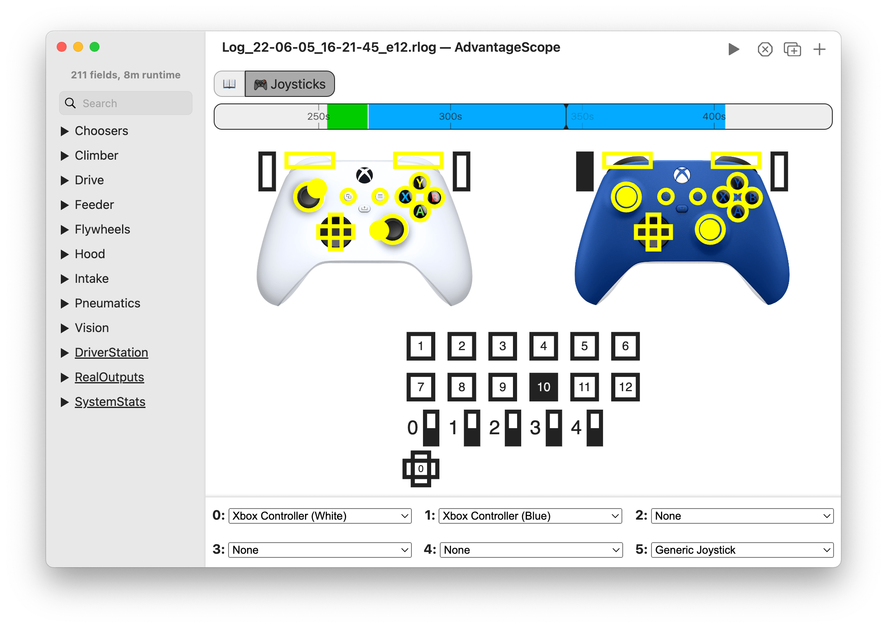

# 🎮 Joysticks

The joysticks tab shows the state of up to six connected controllers. The image below shows an example layout, with two Xbox controller and a generic joystick. Each button highlights when it is pressed, and the states of joysticks and other axes are displayed.

Timeline Controls

The timeline is used to control playback and visualization. Clicking on the timeline selects a time, and right-clicking deselects it. The selected time is synchronized across all tabs, making it easy to quickly find this location in other views.

The green sections of the timeline indicate when the robot is autonomous, and the blue sections indicate when the robot is teleoperated.

To zoom, place the cursor over the timeline and scroll up or down. A range can also be selecting by clicking and dragging while holding `Shift`. Move left and right by scrolling horizontally (on supported devices), or by clicking and dragging on the timeline. When connected live, scrolling to the left unlocks from the current time, and scrolling all the way to the right locks to the current time again.

## Control Pane

Select the joystickstypes in the table at the bottom of the tab. Joystick IDs range from 0 to 5, and match the IDs in the Driver Station and WPILib. More information about joysticks can be found in the [WPILib documentation](https://docs.wpilib.org/en/stable/docs/software/basic-programming/joystick.html).

AdvantageScope includes a set of common joysticks, including a "Generic Joystick" with all buttons, axes, and POVs in a grid format (seen above). To add a custom joystick, see [Custom Assets](../more-features/custom-assets.md).

:::warning
**Joystick data is NOT available via a NetworkTables connection with stock WPILib.** WPILib log files (with [joystick logging enabled](https://docs.wpilib.org/en/stable/docs/software/telemetry/datalog.html#logging-joystick-data)), AdvantageKit logs, and AdvantageKit streaming are supported.
:::
