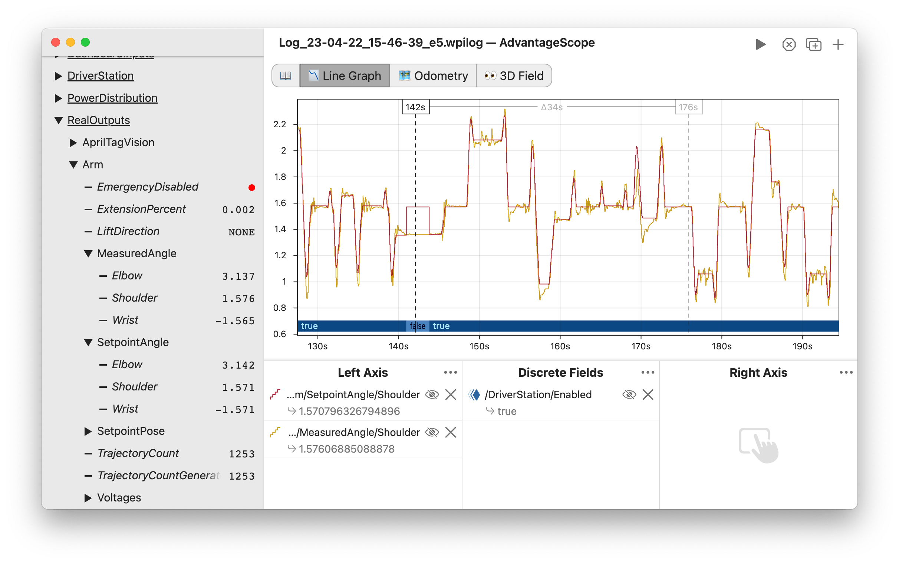

import Image2 from './img/line-graph-2.png';
import Image3 from './img/line-graph-3.png';

# 📉 Line Graph

The line graph is the default view in AdvantageScope. It supports both continuous (numerical) and discrete fields.

## Viewer Pane

To zoom, place the cursor over the main graph and scroll up or down. A range can also be selecting by clicking and dragging while holding `Shift`. Move left and right by scrolling horizontally (on supported devices), or by clicking and dragging on the graph. When connected live, scrolling to the left unlocks from the current time, and scrolling all the way to the right locks to the current time again.

Clicking on the graph selects a time, and right-clicking deselects it. The value of each field at that time is displayed in the legend. The selected time is synchronized across all tabs, making it easy to quickly find this location in other views.

:::tip
The delta between the selected and hovered times is displayed as an overlay on the graph, making it easy to measure time ranges.
:::

## Control Pane

To get started, drag a field to one of the three sections (left, right, or discrete). Delete a field using the X button, or hide it temporarily by clicking the eye icon or double-clicking the field name. To remove all fields, click the three dots near the axis title and then `Clear All`. Fields can be rearranged in the list by clicking and dragging.

:::info
The color and line style of each field can be customized by clicking the colored icon or right-clicking on the field name.
:::

### Adjusting Axes

By default, each axis adjusts its range based on the visible data. To disable auto-ranging and lock the range to its current min and max, click the three dots near the axis title and then `Lock Axis`. To manually adjust the range, choose `Edit Range...` and enter the desired values.

### Unit Conversion

To adjust the units for an axis, click the three dots near the axis title and then `Unit Conversion...`. Select the type of unit and the required conversion. Each value is also multiplied by the "Extra Factor", allowing for custom conversions (like gear ratios, angular to linear conversions, or other units not provided by AdvantageScope). The factor can also be entered using a mathematical expression such as `1.5*pi`.

:::tip
To quickly enable or disable unit conversion, click the three dots near the axis title and choose `Recent Presets` or `Reset Units`.
:::

### Integration & Differentiation

Values can be automatically integrated or differentiated by AdvantageScope. Click the three dots near the axis title and then select `Differentiate` or `Integrate`.

:::info
Derivates are calcaulated using the [finite difference](https://en.wikipedia.org/wiki/Finite_difference) of adjacent samples. Integrals are calculated using [trapezoidal integration](https://en.wikipedia.org/wiki/Trapezoidal_rule).
:::
