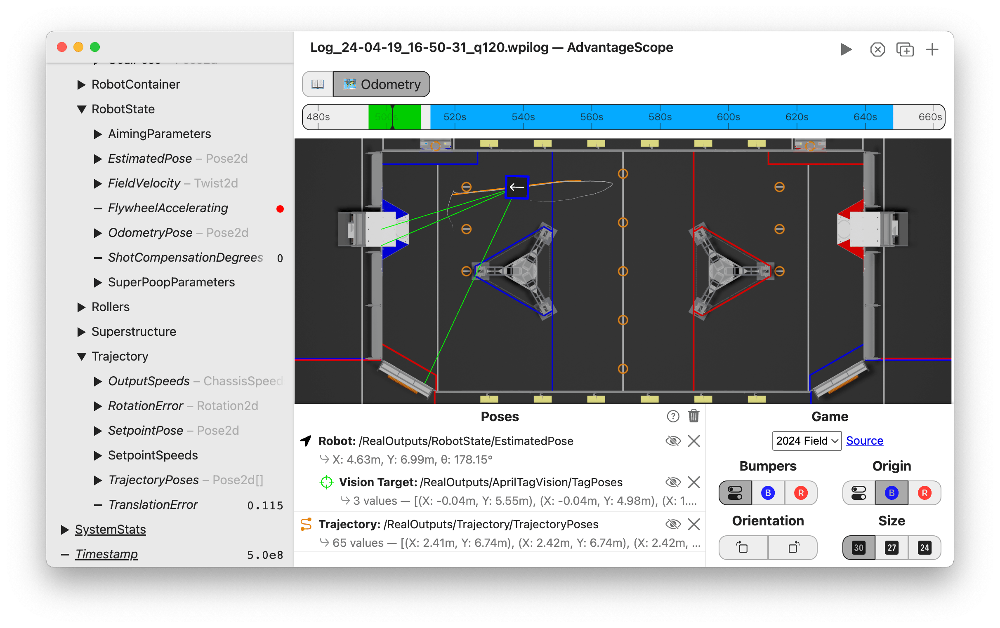
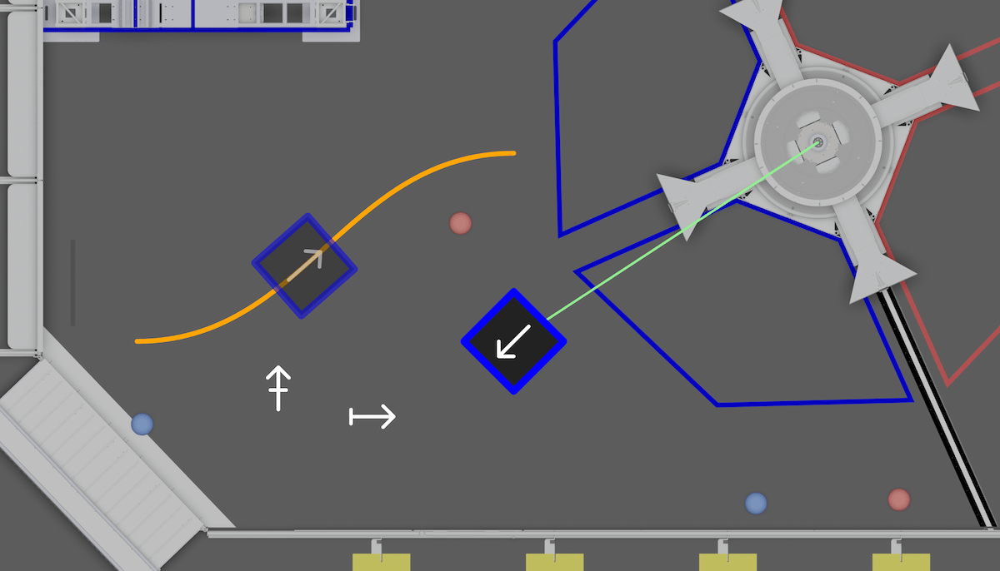

import Tabs from '@theme/Tabs';
import TabItem from '@theme/TabItem';

# 🗺 Odometry

The odometry tab shows a 2D visualization of the robot overlayed on a map of the field. It can also show extra data like vision targeting status and reference poses.



<details>
<summary>Timeline Controls</summary>

The timeline is used to control playback and visualization. Clicking on the timeline selects a time, and right-clicking deselects it. The selected time is synchronized across all tabs, making it easy to quickly find this location in other views.

The green sections of the timeline indicate when the robot is autonomous, and the blue sections indicate when the robot is teleoperated.

To zoom, place the cursor over the timeline and scroll up or down. A range can also be selecting by clicking and dragging while holding `Shift`. Move left and right by scrolling horizontally (on supported devices), or by clicking and dragging on the timeline. When connected live, scrolling to the left unlocks from the current time, and scrolling all the way to the right locks to the current time again.


</details>

## Adding Objects

To get started, drag a field to the "Poses" section. Delete an object using the X button, or hide it temporarily by clicking the eye icon or double-clicking the field name. To remove all objects, click the trash can near the axis title and then `Clear All`. Objects can be rearranged in the list by clicking and dragging.

**To customize each object, click the colored icon or right-click on the field name.** AdvantageScope supports a large number of object types, many of which can be customized (such as changing colors). Some objects must be added as children to an existing object.

:::tip
To see a full list of supported object types, click the `?` icon. This list also includes the supported data types and whether the objects must be added as children.
:::



## Data Format

Geometry data should be published as a byte-encoded struct or protobuf. Various 2D and 3D geometry types are supported, including `Pose2d`, `Pose3d`, `Translation2d`, `Translation3d`, and more.

:::warning
The legacy number array format for geometry data is now deprecated. See [here](../whats-new/legacy-formats.md) for details.
:::

Many FRC libraries support the struct format, including WPILib and AdvantageKit. The example code below shows how to log 2D pose data in Java.

<Tabs>
<TabItem value="wpilib" label="WPILib" default>

```java
Pose2d poseA = new Pose2d();
Pose2d poseB = new Pose2d();

StructPublisher<Pose2d> publisher = NetworkTableInstance.getDefault()
  .getStructTopic("MyPose", Pose2d.struct).publish();
StructArrayPublisher<Pose2d> arrayPublisher = NetworkTableInstance.getDefault()
  .getStructArrayTopic("MyPoseArray", Pose2d.struct).publish();

periodic() {
  publisher.set(poseA);
  arrayPublisher.set(new Pose2d[] {poseA, poseB});
}
```

:::tip
WPILib's [`Field2d`](https://docs.wpilib.org/en/stable/docs/software/dashboards/glass/field2d-widget.html) class can also be used to log several sets of 2D pose data together.
:::

</TabItem>
<TabItem value="advantagekit" label="AdvantageKit">

```java
Pose2d poseA = new Pose2d();
Pose2d poseB = new Pose2d();

Logger.recordOutput("MyPose", poseA);
Logger.recordOutput("MyPoseArray", poseA, poseB);
Logger.recordOutput("MyPoseArray", new Pose2d[] {poseA, poseB});
```

</TabItem>
</Tabs>

## Configuration

- **Game:** The field image to use, defaults to the most recent game. To add a custom field image, see [Custom Assets](../more-features/custom-assets.md).
- **Bumpers:** The color of the robot's bumpers. Choosing the switch icon will use the current alliance color.
- **Origin:** The position of the field origin, on the blue or red alliance wall. Choosing the switch icon will use the current alliance color
- **Orientation:** The orientation of the field image in the viewer pane.
- **Size:** The side length of the robot (30 inches, 27 inches, or 24 inches).

:::warning
Automatic selection of alliance color may be inaccurate when viewing log data produced by AdvantageKit 2023 or earlier.
:::
