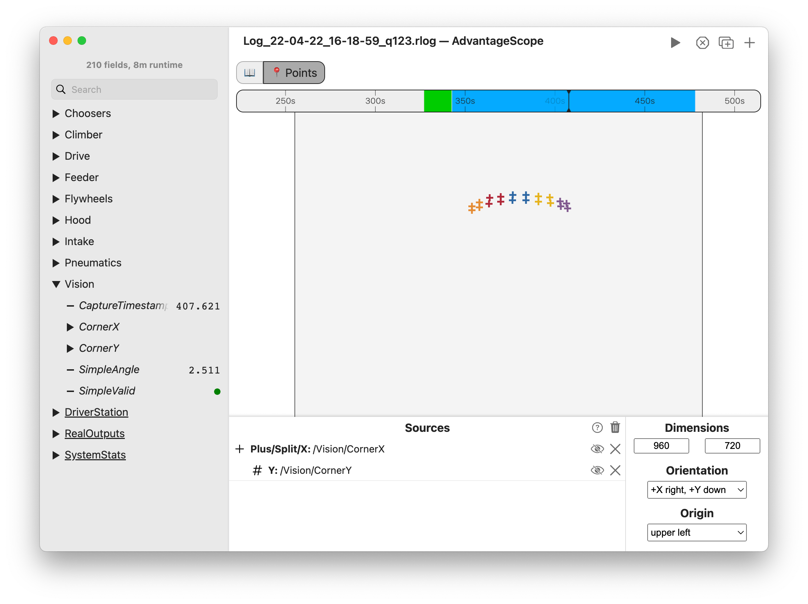

import Tabs from '@theme/Tabs';
import TabItem from '@theme/TabItem';

# 📍 Points

The points tab shows a 2D visualization of arbitrary points. This is a very flexible tool, allowing for custom visualizations of vision data/pipelines, mechanism states, etc.



<details>
<summary>Timeline Controls</summary>

The timeline is used to control playback and visualization. Clicking on the timeline selects a time, and right-clicking deselects it. The selected time is synchronized across all tabs, making it easy to quickly find this location in other views.

The green sections of the timeline indicate when the robot is autonomous, and the blue sections indicate when the robot is teleoperated.

To zoom, place the cursor over the timeline and scroll up or down. A range can also be selecting by clicking and dragging while holding `Shift`. Move left and right by scrolling horizontally (on supported devices), or by clicking and dragging on the timeline. When connected live, scrolling to the left unlocks from the current time, and scrolling all the way to the right locks to the current time again.


</details>

## Adding Sources

To get started, drag a field to the "Sources" section. Delete a source using the X button, or hide it temporarily by clicking the eye icon or double-clicking the field name. To remove all objects, click the trash can near the axis title and then `Clear All`. Sources can be rearranged in the list by clicking and dragging.

**To customize each source, click the colored icon or right-click on the field name.** The symbol, color, and size of each source can be adjusted.

:::tip
To see a full list of supported sources types, click the `?` icon. This list also includes the supported data types.
:::

## Data Format

Point data should be published as a byte-encoded struct or protobuf, using the `Translation2d[]` type. Many FRC libraries support this format, including WPILib and AdvantageKit. The example code below shows how to log point data in Java.

<Tabs>
<TabItem value="wpilib" label="WPILib" default>

```java
StructArrayPublisher<Translation2d> publisher = NetworkTableInstance.getDefault()
  .getStructArrayTopic("MyTranslations", Translation2d.struct).publish();

periodic() {
  publisher.set(new Translation2d[] {
    new Translation2d(0.0, 1.0),
    new Translation2d(2.0, 3.0)
  });
  publisher.set(
    new Translation2d(0.0, 1.0),
    new Translation2d(2.0, 3.0)
  );
}
```

</TabItem>
<TabItem value="advantagekit" label="AdvantageKit">

```java
Logger.recordOutput("MyTranslations",
  new Translation2d[] {
    new Translation2d(0.0, 1.0),
    new Translation2d(2.0, 3.0)
  });
Logger.recordOutput("MyTranslations",
  new Translation2d(0.0, 1.0),
  new Translation2d(2.0, 3.0)
);
```

</TabItem>
</Tabs>

## Configuration

The following configuration options are available:

- **Dimensions:** The size of the display area. This can use any units that match the published points. When displaying vision data, this is the resolution of the camera.
- **Orientation:** The coordinate system to use (orientation of X and Y axes).
- **Origin:** The position of the origin in the coordinate system.
