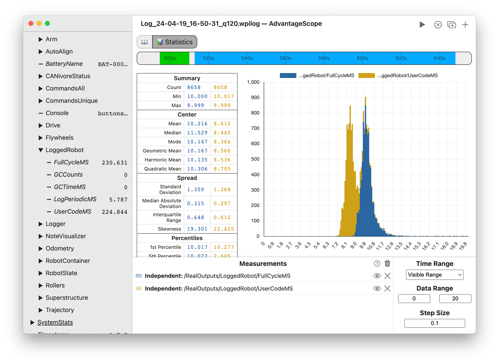

# 📊 Statistics

The statistics tab allows for deep statistical analysis of numerical fields, analyzing overall trends rather than changes over time. The selected fields are analyzed using a histogram and a variety of standard statistical measures.

## Control Pane

To get started, drag a field to the "Measurements" section. Delete a field using the X button, or hide it temporarily by clicking the eye icon or double-clicking the field name. To remove all fields, click the three dots near the axis title and then `Clear All`. Fields can be rearranged in the list by clicking and dragging.

To analyze the difference between fields, switch a field to "Reference" mode and additional other fields as children. Children can be switched between "Relative Error" and "Absolute Error" modes.

:::info
The color of each field can be customized by clicking the colored icon or right-clicking on the field name.
:::

### Configuration

The **Time Range** option selectes what parts of the log are used for analysis:

- _Visible Range:_ Analyzes the range of time visible on the timeline.
- _Full Log:_ Analyzes the full range of the log file.
- _Enabled:_ Analyzes time ranges where the robot is enabled.
- _Auto:_ Analyzes time ranges where the robot is autonomous.
- _Teleop:_ Analyzes time ranges where the robot is teleoperated.
- _Live: 30 Seconds:_ Analyzes the most recent 30 seconds (when connected to a live source).
- _Live: 10 Seconds:_ Analyzes the most recent 10 seconds (when connected to a live source).

The **Data Range** option selects the min and max values to display on the histogram. Data outside this range is not shown, but it continues to be used for the statistical measures.

The **Step Size** option selects the size of each histogram bin. Smaller values produce more detailed graphs, but also reveal more noise.

## Viewer Pane

### Histogram

The histogram shows the number of samples that fall in each bin, within the specific range. Note that data outside the specified range is discarded (rather than being grouped into a separate bin).

### Statistical Measures

The table of statistical measures shows the calculated values of each measure for the provided fields. More information on each measure is provided below.

#### Summary

- **Count:** The number of discrete samples generated.
- **Min:** The smallest value in the data.
- **Max:** The largest value in the data.

#### Center

- [**Mean:**](https://en.wikipedia.org/wiki/Arithmetic_mean) The arithmetic mean (simple average) of the data.
- [**Median:**](https://en.wikipedia.org/wiki/Median) The "middle" value of the data, or the 50% percentile.
- [**Mode:**](<https://en.wikipedia.org/wiki/Mode_(statistics)>) The most common value in the data.
- [**Geometric Mean:**](https://en.wikipedia.org/wiki/Geometric_mean) A measure of center calculated using the product of the values rather than the sum. Applicable when measuring _exponential growth rates_ (like percent change between cycles).
- [**Harmonic Mean:**](https://en.wikipedia.org/wiki/Harmonic_mean) A measure of center calculated using the sum of the reciprocals of the values. Applicable when measuring _rates or velocities_.
- [**Quadratic Mean:**](https://en.wikipedia.org/wiki/Root_mean_square) A measure of center calculated using the squares of the values. Applicable when measuring data with both _positive and negative values_, like periodic motion.

#### Spread

- [**Standard Deviation:**](https://en.wikipedia.org/wiki/Standard_deviation) The most common statistical measure of variation, where a lower value indicates less variation. 68% of the data falls within one standard deviation of the mean.
- [**Mean Absolute Deviation:**](https://en.wikipedia.org/wiki/Average_absolute_deviation) The average distance between each value and the mean. This is an alternative to the standard deviation.
- [**Interquartile Range:**](https://en.wikipedia.org/wiki/Interquartile_range) The difference between the third and first quartiles (75th percentile and 25th percentile), less affected by outliers than the standard deviation or mean absolute deviation.
- [**Skewness:**](https://en.wikipedia.org/wiki/Skewness) A measure of the asymmetric skew of the data. A negative value indicates a tail to the left, a positive value indicates a tail to the right, and a zero value suggests a symmetric distribution.

#### Percentiles

The [percentiles](https://en.wikipedia.org/wiki/Percentile) measure values below which the given percentage of other values fall. For example, 10% of values fall below the 10th percentile. The following percentiles are also known as:

- 25th Percentile = 1st quartile (Q1)
- 50th Percentile = 2nd quartile (Q2) = median
- 75th Percentile = 3rd quartile (Q3)
