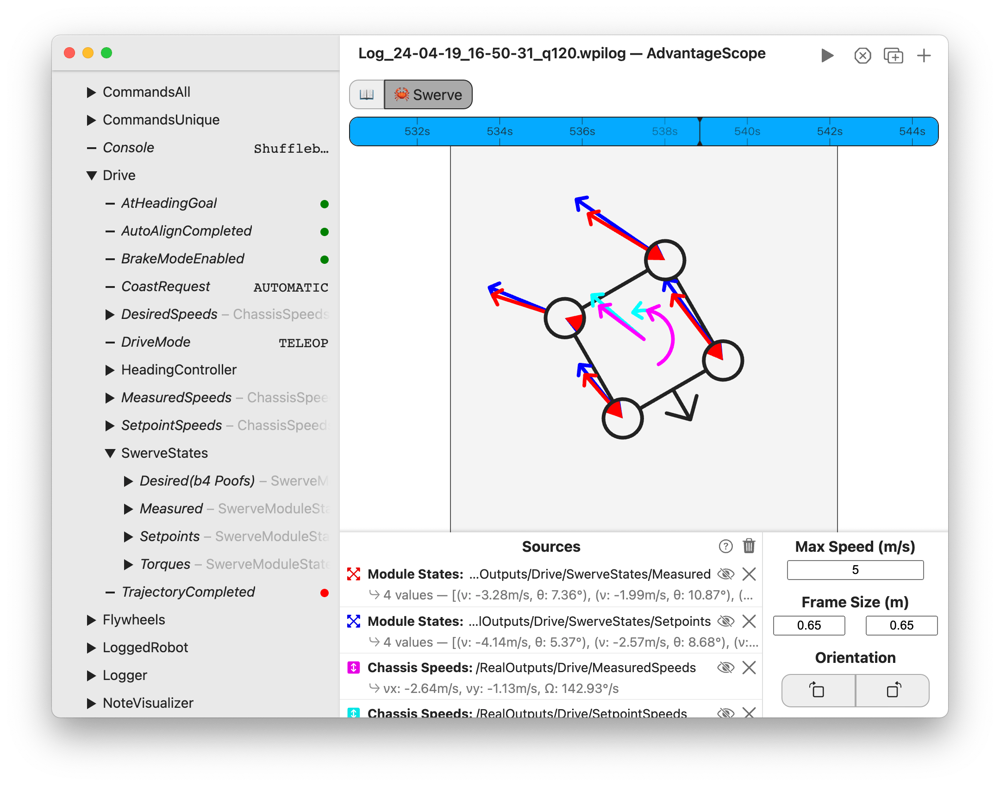

import Tabs from '@theme/Tabs';
import TabItem from '@theme/TabItem';

# 🦀 Swerve

The swerve tab shows the state of four swerve modules, including the velocity vectors, idle positions, robot rotation, and chassis speeds.



<details>
<summary>Timeline Controls</summary>

The timeline is used to control playback and visualization. Clicking on the timeline selects a time, and right-clicking deselects it. The selected time is synchronized across all tabs, making it easy to quickly find this location in other views.

The green sections of the timeline indicate when the robot is autonomous, and the blue sections indicate when the robot is teleoperated.

To zoom, place the cursor over the timeline and scroll up or down. A range can also be selecting by clicking and dragging while holding `Shift`. Move left and right by scrolling horizontally (on supported devices), or by clicking and dragging on the timeline. When connected live, scrolling to the left unlocks from the current time, and scrolling all the way to the right locks to the current time again.


</details>

## Adding Sources

To get started, drag a field to the "Sources" section. Delete a source using the X button, or hide it temporarily by clicking the eye icon or double-clicking the field name. To remove all sources, click the trash can near the axis title and then `Clear All`. Sources can be rearranged in the list by clicking and dragging.

**To customize each source, click the colored icon or right-click on the field name.** AdvantageScope supports three sources types:

- **Module States:** A set of four swerve module states, displayed as vectors on the diagram.
- **Chassis Speeds:** Linear and angular speeds displayed in the center of the diagram.
- **Rotation:** Angular position used to rotate the diagram.

## Data Format

Data should be published as a byte-encoded struct or protobuf, using the `SwerveModuleState[]`, `ChassisSpeeds`, `Rotation2d`, or `Rotation3d` types.

:::warning
The legacy number array format for swerve data is now deprecated. See [here](../whats-new/legacy-formats.md) for details.
:::

Many FRC libraries support the struct format, including WPILib and AdvantageKit. The example code below shows how to log swerve module states in Java.

<Tabs>
<TabItem value="wpilib" label="WPILib" default>

```java
SwerveModuleState[] states = new SwerveModuleState[] {
  new SwerveModuleState(),
  new SwerveModuleState(),
  new SwerveModuleState(),
  new SwerveModuleState()
}

StructArrayPublisher<SwerveModuleState> publisher = NetworkTableInstance.getDefault()
.getStructArrayTopic("MyStates", SwerveModuleState.struct).publish();

periodic() {
  publisher.set(states);
}
```

</TabItem>
<TabItem value="advantagekit" label="AdvantageKit">

```java
SwerveModuleState[] states = new SwerveModuleState[] {
  new SwerveModuleState(),
  new SwerveModuleState(),
  new SwerveModuleState(),
  new SwerveModuleState()
}

Logger.recordOutput("MyStates", states);
```

</TabItem>
</Tabs>

## Configuration

The following configuration options are available:

- **Max Speed:** The maximum achievable speed of the modules, used to adjust the size of the vectors.
- **Frame Size:** The distances between the left-right and front-back swerve modules. Changes the aspect ratio of the robot diagram.
- **Orientation:** Adjusts the direction the robot diagram is pointed. This option is often useful to align with odometry data or match videos.

:::note
[🦀 🦀 🦀 🦀 🦀 🦀 🦀 🦀 🦀](https://www.youtube.com/watch?v=IbbwtyM8Dxs)
:::
