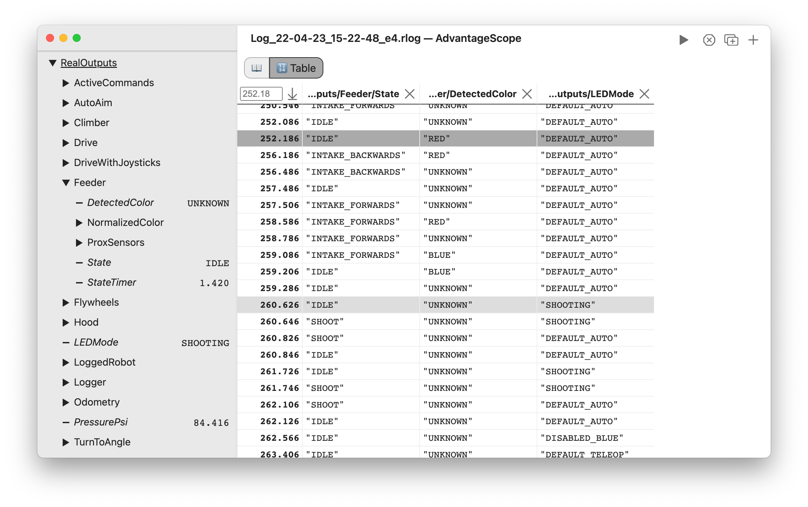
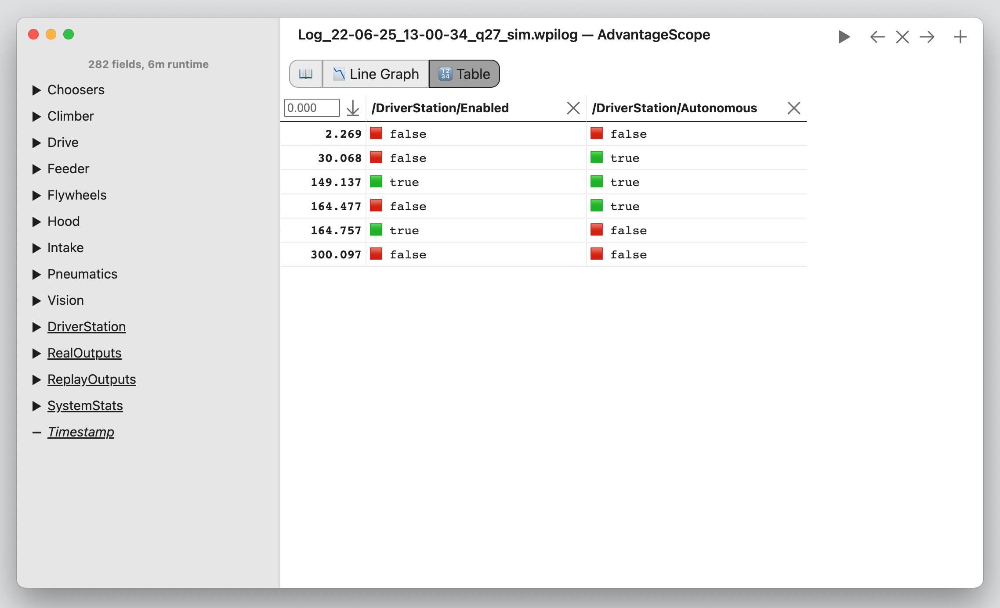
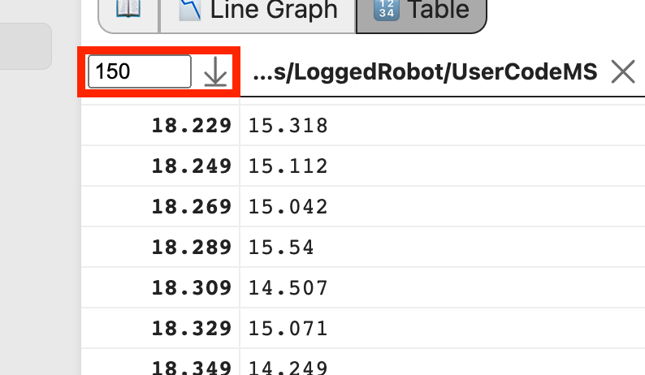

# 🔢 Table

The table view is designed to show the specific value changes for a set of fields in more detail than the 📉 [Line Graph](../tab-reference/line-graph.md). To add a field, drag it to the main view. To delete a field, click the "X" button next to its name.

**A new row is created for each change in any of the displayed fields.** Duplicate rows are not displayed. For example, a table showing the robot state during a match would look like this:

The selected time in the table is synchronized across all tabs. Click a row to select it, or hover over a row to preview it in any visible pop-up windows. Clicking the ↓ button jumps to the selected time (or the time entered in the box).

