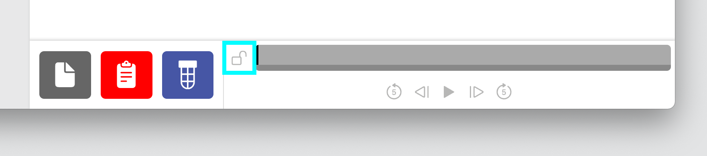

# 🎬 Video

The video tab allows for the log data to be compared side-by-side with a match video that was separately recorded. The steps below show how to load a video and synchronize it with the log.

## Loading the Video

AdvantageScope provides three options for loading a video:

1. **Local File:** Click the gray file icon, then choose the video file to load. Most common video formats are support.
2. **YouTube:** Copy a YouTube link to the clipboard, then click the red clipboard icon. After a few seconds, the video will begin to download.
3. **The Blue Alliance:** Click the blue TBA icon to automatically load the match video based on the log file. If multiple videos are available, choose the video to download from the popup menu. This feature requires an API key for TBA, which should be obtained at [thebluealliance.com/account](https://www.thebluealliance.com/account) and copied to the AdvantageScope preferences page under "TBA API Key".

After choosing a video, the timeline on the bottom right begins turning blue to indicate the frames that have been cached (this step is necessary for smooth playback). This feature is intended for match-length videos only due to the frame conversion required.

:::warning
YouTube and TBA video download may failed unexpectedly due to changes on YouTube's servers. In case of issues, trying updating AdvantageScope or using a local video file instead.
:::

## Navigating the Video

When a video is initially loaded and has not yet been synchronized with the log data, the playback controls for the video and log are still independent. Use the timeline and buttons on the bottom right to control the video playback. The following keyboard shortcuts are also supported:

- / = toggle playback
- → = move forward one frame
- ← = move backward one frame
- \> = skip forward five seconds
- < = skip backward five seconds

## Automatic Synchronization

Most match videos will be synchronized automatically with the log shortly after the frames for the autonomous period of the match are loaded. No action is required; if synchronization succeeds, the video controls will be locked automatically (see "Playback" below).

:::warning
Automatic synchronization only works on match videos that include score overlays, and may not succeed in all cases. If the video controls are not locked automatically once all frames are loaded, manual synchronization is required.
:::

## Manual Synchronization

First, use the video controls to navigate to a known location in the match like the start of auto. Then, select the time in the log file that aligns with the current frame of the video.

:::tip
The cursor on the timeline snaps to the start and end of match periods, making it easier to precisely select the start of the match.
:::

Once the video and log are aligned, click the lock icon next to the video timeline (or press **↑ or ↓**). The video controls are now disabled. Click the lock icon again to unlock the video playback.

## Playback

Once locked, the video playback stays aligned with the selected time in the log. Note that sound playback is not supported since the original video is converted to a frame-by-frame representation to support log synchronization.

Timeline Controls

The timeline is used to control playback and visualization. Clicking on the timeline selects a time, and right-clicking deselects it. The selected time is synchronized across all tabs, making it easy to quickly find this location in other views.

The green sections of the timeline indicate when the robot is autonomous, and the blue sections indicate when the robot is teleoperated.

To zoom, place the cursor over the timeline and scroll up or down. A range can also be selecting by clicking and dragging while holding `Shift`. Move left and right by scrolling horizontally (on supported devices), or by clicking and dragging on the timeline. When connected live, scrolling to the left unlocks from the current time, and scrolling all the way to the right locks to the current time again.

:::tip
If desired, the camera FOV can be adjusted in the 3D field view to match the look of the video. For details, see "Camera Options" on the 👀 [3D Field](../tab-reference/3d-field.md) page.
:::

