# What's New in 2025?

<h2 style={{textAlign: "center"}}>Swift, Simple, Smart</h2>

The 2025 version of AdvantageScope is now in **beta**, and includes over **130 new features and updates!** Check the [full changelog](./full-changelog.md) for a complete list. Some of the most notable new features are explained below.

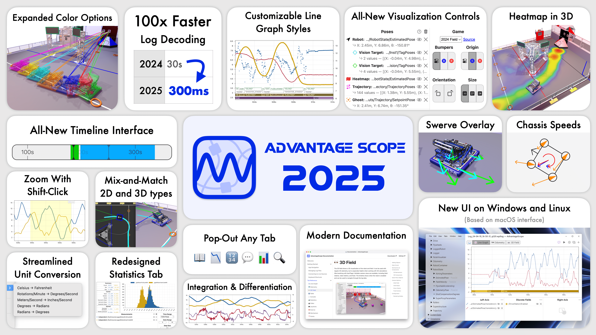

### ⏩ 100x Faster Log Decoding

(That's not a typo.)

Below is an hour-long 140MB log file being decoded by the 2024 and 2025 versions of AdvantageScope. The decode time goes from **30 seconds** to **300 _milliseconds_**.

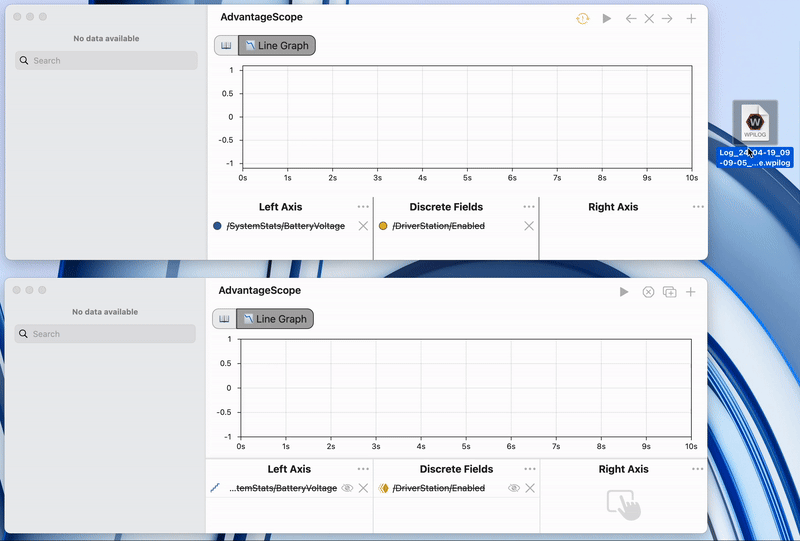

### ⏳ All-New Timeline Interface

The timeline interface has been completely redesigned to enable precise scrubbing, with controls for **zooming and panning**. Auto and teleop match periods are also color coded for easier navigation.

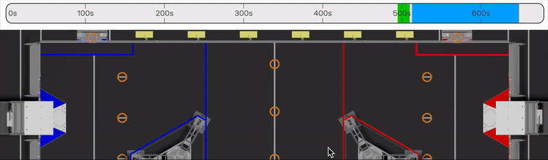

### 🎛️ All-New Control Interface

The visualization controls for many tabs, including the 🗺️ [Odometry](../tab-reference/odometry.md) and 👀 [3D Field](../tab-reference/3d-field.md) tabs have been redesigned from scratch to make the interface more **simple, consistent, and capable**. New features like nested objects, visibility toggles, and object settings make it easier to get started while enabling advanced new visualization options.

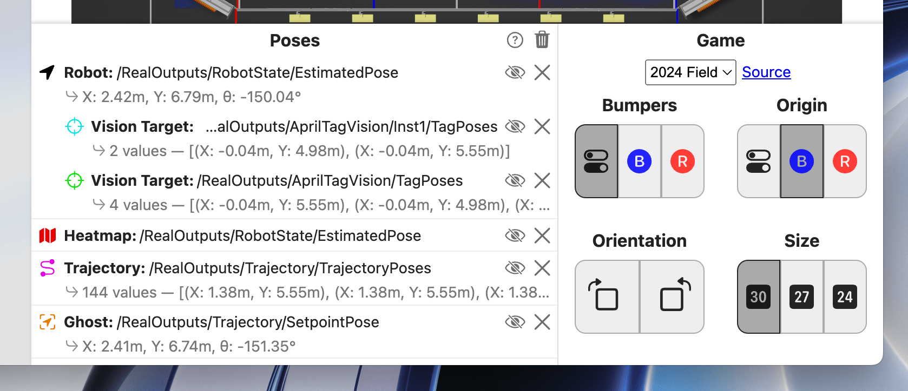

### 🎨 Expanded Color Options

Several brand-new colors are available when visualizing **ghosts, vision targets, and trajectories**. And for the first time, multiple ghost colors are supported on the 🗺️ [Odometry](../tab-reference/odometry.md) tab!

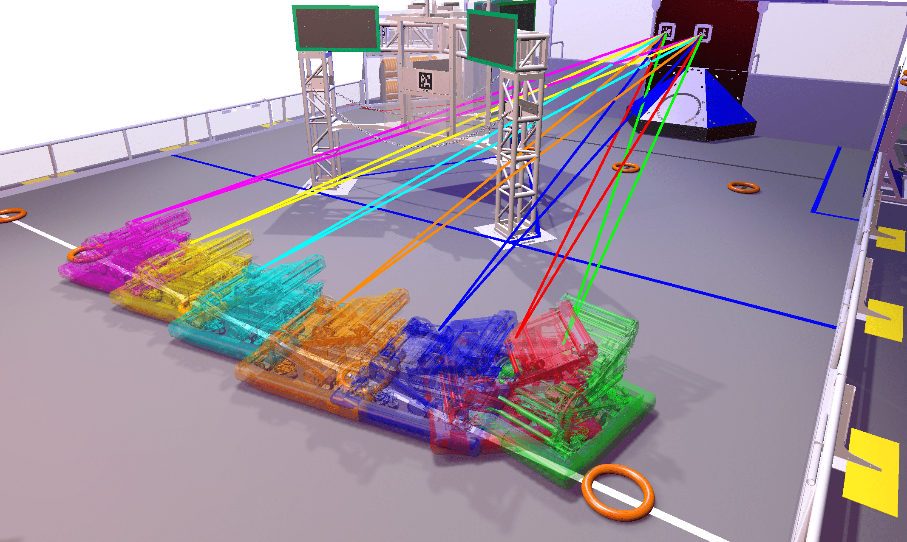

...

### 🦀 New Swerve Visualizations

Swerve module states can be **visualized in 2D or 3D** by overlaying vectors on the 🗺️ [Odometry](../tab-reference/odometry.md) and 👀 [3D Field](../tab-reference/3d-field.md) tabs.

Looking to go deeper? Try visualizing **chassis speeds** on the 🦀 [Swerve](../tab-reference/swerve.md) tab, which can now display an unlimited number of data sets!

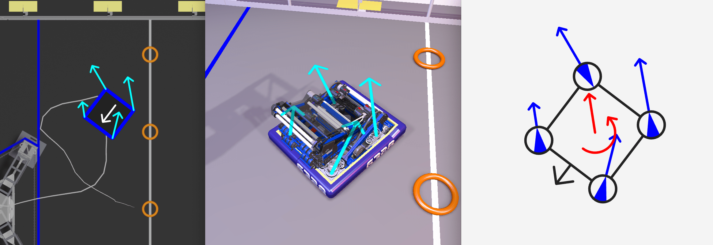

### 📉 Line Graph Improvements

Fields displayed on the 📉 [Line Graph](../tab-reference/line-graph.md) can now be customized by changing the **thickness, color, and style** (stepped, smooth, or points).

New **integration** and **differentiation** options, along with a **streamlined unit conversion** interface, make advanced analysis even easier.

Want to visualize even more data at once? Try **popping out the line graph** to a separate window!

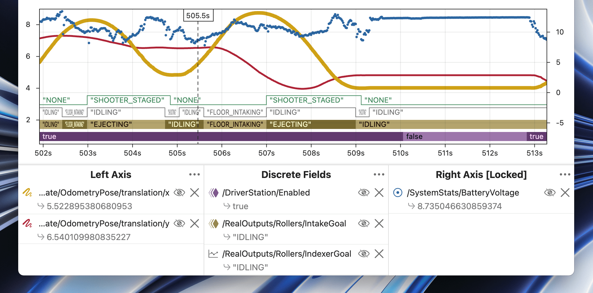

### 📊 Redesigned Statistics View

The 📊 [Statistics](../tab-reference/statistics.md) tab is redesigned with several new capabilities. It supports an **unlimited number of fields** with more flexibility for calculating **absolute and relative errors**.

New range options enable easy selection just by **panning and zooming on the timeline**, or look at live-updating data by showing the **most recent 10 or 30 seconds** while connected to a live source.

The statistics tab also supports **pop-out windows** for the first time!

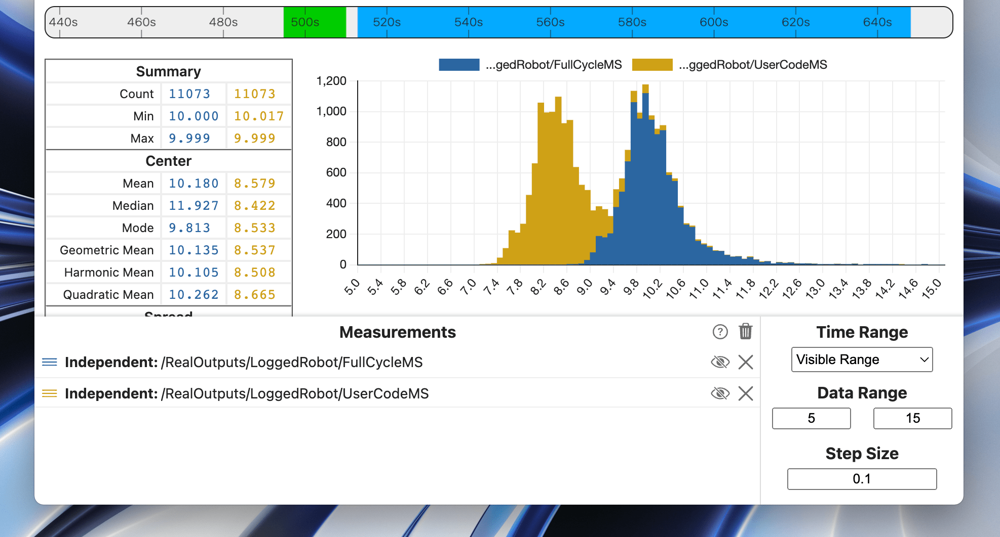

### 🌡️ Heatmap Upgrades

Heatmaps can now be viewed on the 👀 [3D Field](../tab-reference/3d-field.md) tab! Plus, new range options allow filtering to **auto**, **teleop**, or **teleop excluding endgame** (to eliminate climbing sequences that throw off the visualization).

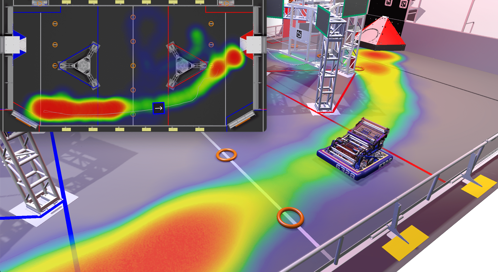

### 🤩 New UI on Windows and Linux

The AdvantageScope UI on Windows has been redesigned for a cleaner look with an **integrated menu and title bars**. The menu bar on Linux uses the same updated style. This cleaner window design was previously only available on macOS.

### 🥇 First-Class Struct Support

The WPILib struct format is type-safe and unit-safe, allowing **2D and 3D poses to be intermixed** for the first time. Visualize 3D poses on the 2D field (or vice-versa), without ever worrying about mixing up data types or units! AdvantageScope is also smarter when **suggesting possible object types**, ensuring that data is always displayed correctly.

:::warning
As part of our transition to struct, the legacy number array format for geometry data is now deprecated. See [this page](./legacy-formats.md) for details.
:::

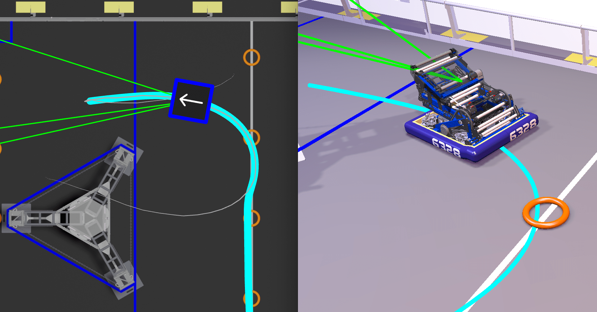

### 📖 New Documentation Site

You're viewing the updated version of the AdvantageScope documentation, which supports **easier navigation** via the sidebar and a more **refined mobile interface**. This documentation can be accessed online at [docs.advantagescope.org](https://docs.advantagescope.org), or offline by clicking the 📖 icon in the tab bar.

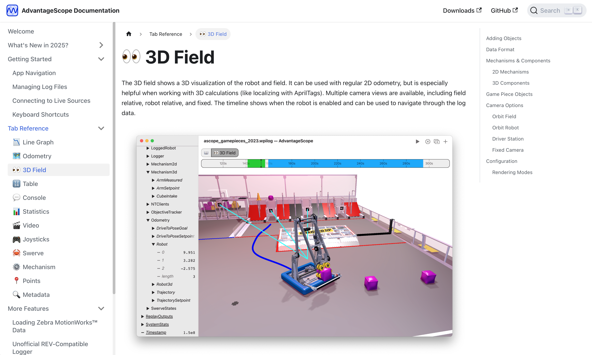
